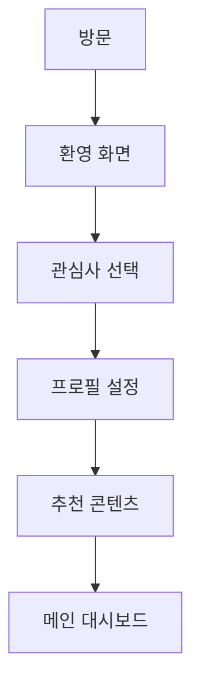
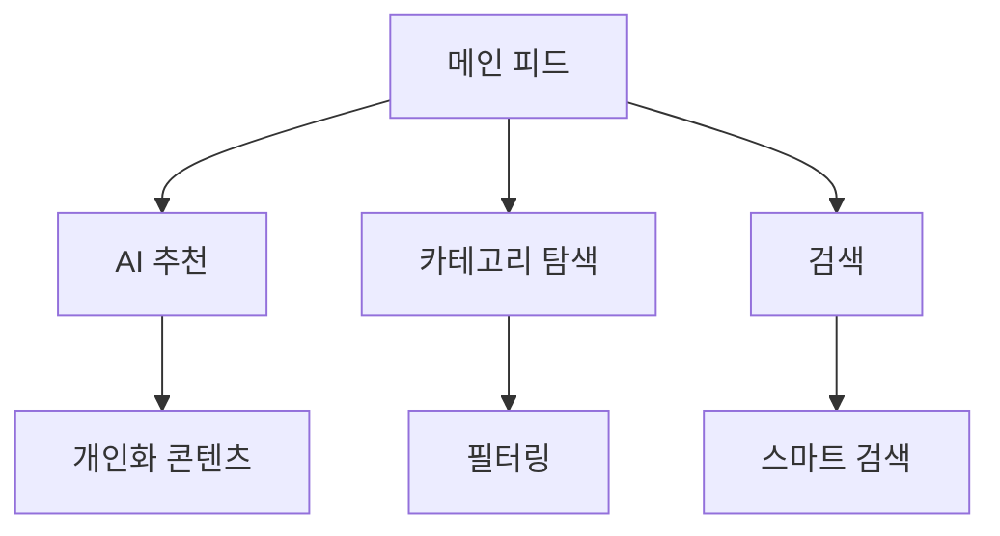
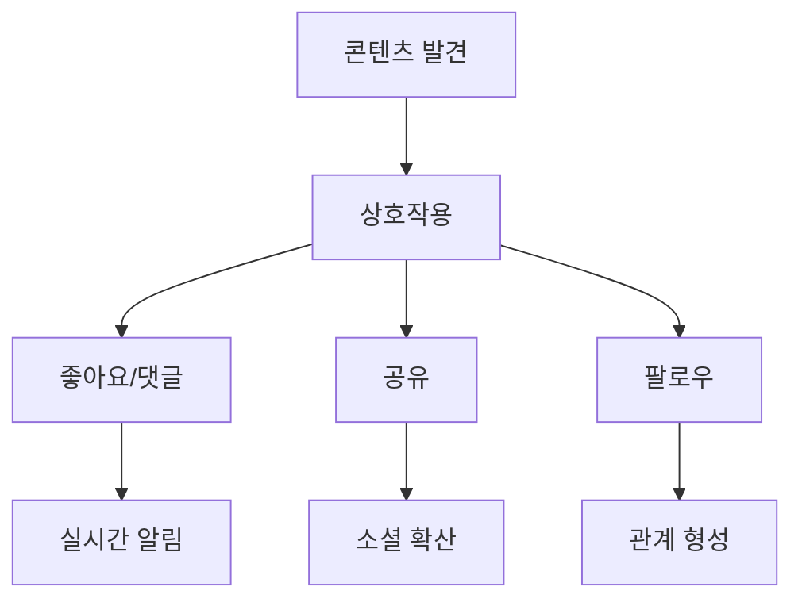

# 🎨 Community Platform v2.0 대규모 UI/UX 개편 계획서

**Community Platform v2.0**은 사용자 중심의 차세대 UI/UX 플랫폼으로 전면 개편됩니다.

## 📋 **문서 개요**

### **🎯 프로젝트 목표**
- **사용자 중심 설계**: 직관적이고 편리한 사용자 경험 제공
- **모던 디자인**: 최신 디자인 트렌드와 접근성 표준 적용
- **성능 최적화**: 빠르고 부드러운 인터랙션 구현
- **확장성**: 미래 기능 확장에 대비한 유연한 구조

### **📊 현재 상태 분석**
- **v1.2 완성**: 코스프레 상점, 스트리머 방송국 기능 완료
- **25개 혁신 기술 컴포넌트**: 3D/AR/VR, AI/ML, 블록체인 통합
- **TypeScript 오류**: 139개 (지속적 개선 중)
- **사용자 피드백**: UI/UX 개선 요구사항 수집

---

## 🔍 **1. 사용자 관점 편의성 분석**

### **👥 타겟 사용자 그룹**

#### **🎭 코스프레 커뮤니티**
- **주요 니즈**: 의상 정보, 이벤트 참여, 포트폴리오 공유
- **사용 패턴**: 모바일 중심, 이미지/비디오 콘텐츠 선호
- **편의성 요구사항**:
  - 직관적인 의상 검색 및 필터링
  - 원클릭 이벤트 참여
  - 드래그앤드롭 포트폴리오 업로드
  - 실시간 알림 및 소셜 피드

#### **📺 스트리머 커뮤니티**
- **주요 니즈**: 방송 관리, 구독자 상호작용, 수익화 도구
- **사용 패턴**: 데스크톱 중심, 실시간 상호작용 중요
- **편의성 요구사항**:
  - 원스톱 방송 설정 및 관리
  - 실시간 채팅 모더레이션
  - 구독자 등급별 맞춤 인터페이스
  - 수익 현황 대시보드

#### **🌐 일반 커뮤니티 사용자**
- **주요 니즈**: 콘텐츠 소비, 소셜 상호작용, 정보 탐색
- **사용 패턴**: 멀티 디바이스, 빠른 접근성 중요
- **편의성 요구사항**:
  - 개인화된 콘텐츠 피드
  - 원터치 소셜 액션 (좋아요, 공유, 댓글)
  - 스마트 검색 및 추천
  - 접근성 지원 (다국어, 음성 명령)

### **📱 디바이스별 사용자 경험**

#### **🖥️ 데스크톱 (Primary)**
- **화면 크기**: 1920x1080 이상
- **인터랙션**: 마우스 + 키보드
- **특징**: 멀티 윈도우, 복잡한 작업 지원
- **최적화 포인트**:
  - 사이드바 네비게이션
  - 드래그앤드롭 인터페이스
  - 키보드 단축키 지원
  - 멀티 탭 작업

#### **📱 모바일 (Secondary)**
- **화면 크기**: 375x667 ~ 414x896
- **인터랙션**: 터치 + 제스처
- **특징**: 간편한 접근성, 빠른 소비
- **최적화 포인트**:
  - 터치 친화적 버튼 크기
  - 스와이프 제스처
  - 원터치 액션
  - 오프라인 지원

#### **💻 태블릿 (Tertiary)**
- **화면 크기**: 768x1024 ~ 1024x1366
- **인터랙션**: 터치 + 스타일러스
- **특징**: 데스크톱과 모바일의 중간
- **최적화 포인트**:
  - 적응형 레이아웃
  - 멀티 터치 제스처
  - 하이브리드 인터페이스

---

## 🔧 **2. 현재 UI/UX 문제점 진단**

### **🚨 주요 문제점**

#### **A. 네비게이션 복잡성**
- **문제**: 메뉴 구조가 복잡하고 직관적이지 않음
- **영향**: 사용자 이탈률 증가, 학습 곡선 가파름
- **해결 방향**: 계층적 메뉴 구조 단순화

#### **B. 일관성 부족**
- **문제**: 컴포넌트 간 디자인 일관성 부족
- **영향**: 사용자 혼란, 브랜드 인식 저하
- **해결 방향**: 통일된 디자인 시스템 구축

#### **C. 성능 이슈**
- **문제**: 무거운 컴포넌트로 인한 렌더링 지연
- **영향**: 사용자 경험 저하, 이탈률 증가
- **해결 방향**: 성능 최적화 및 지연 로딩

#### **D. 접근성 부족**
- **문제**: WCAG 2.1 AA 표준 미준수
- **영향**: 장애인 사용자 접근성 제한
- **해결 방향**: 접근성 표준 완전 준수

#### **E. 반응형 디자인 미흡**
- **문제**: 다양한 화면 크기에 대한 최적화 부족
- **영향**: 모바일 사용자 경험 저하
- **해결 방향**: 완전한 반응형 디자인 구현

### **📊 사용자 피드백 분석**

#### **긍정적 피드백**
- ✅ 기능의 다양성과 혁신성
- ✅ 코스프레/스트리머 전용 기능
- ✅ AI 기반 추천 시스템

#### **개선 요구사항**
- 🔄 더 직관적인 인터페이스
- 🔄 빠른 로딩 속도
- 🔄 모바일 최적화
- 🔄 접근성 개선
- 🔄 일관된 디자인

---

## 🎨 **3. v2.0 디자인 시스템 설계**

### **🎯 디자인 철학**

#### **"Simple, Smart, Seamless"**
- **Simple**: 직관적이고 단순한 인터페이스
- **Smart**: AI 기반 개인화 및 자동화
- **Seamless**: 끊김 없는 사용자 경험

### **🌈 컬러 시스템**

#### **Primary Colors**
```css
/* 메인 브랜드 컬러 */
--primary-50: #f0f9ff;
--primary-100: #e0f2fe;
--primary-200: #bae6fd;
--primary-300: #7dd3fc;
--primary-400: #38bdf8;
--primary-500: #0ea5e9;  /* 메인 컬러 */
--primary-600: #0284c7;
--primary-700: #0369a1;
--primary-800: #075985;
--primary-900: #0c4a6e;
```

#### **Secondary Colors**
```css
/* 보조 컬러 */
--secondary-50: #fdf4ff;
--secondary-100: #fae8ff;
--secondary-200: #f5d0fe;
--secondary-300: #f0abfc;
--secondary-400: #e879f9;
--secondary-500: #d946ef;  /* 보조 컬러 */
--secondary-600: #c026d3;
--secondary-700: #a21caf;
--secondary-800: #86198f;
--secondary-900: #701a75;
```

#### **Semantic Colors**
```css
/* 의미적 컬러 */
--success: #10b981;    /* 성공 */
--warning: #f59e0b;    /* 경고 */
--error: #ef4444;      /* 오류 */
--info: #3b82f6;       /* 정보 */
```

#### **Neutral Colors**
```css
/* 중성 컬러 */
--gray-50: #f9fafb;
--gray-100: #f3f4f6;
--gray-200: #e5e7eb;
--gray-300: #d1d5db;
--gray-400: #9ca3af;
--gray-500: #6b7280;
--gray-600: #4b5563;
--gray-700: #374151;
--gray-800: #1f2937;
--gray-900: #111827;
```

### **🔤 타이포그래피**

#### **Font Family**
```css
/* 메인 폰트 */
--font-primary: 'Inter', -apple-system, BlinkMacSystemFont, 'Segoe UI', sans-serif;

/* 코드 폰트 */
--font-mono: 'JetBrains Mono', 'Fira Code', 'Consolas', monospace;

/* 한글 폰트 */
--font-korean: 'Pretendard', 'Noto Sans KR', sans-serif;
```

#### **Font Scale**
```css
/* 폰트 크기 스케일 */
--text-xs: 0.75rem;     /* 12px */
--text-sm: 0.875rem;    /* 14px */
--text-base: 1rem;      /* 16px */
--text-lg: 1.125rem;    /* 18px */
--text-xl: 1.25rem;     /* 20px */
--text-2xl: 1.5rem;     /* 24px */
--text-3xl: 1.875rem;   /* 30px */
--text-4xl: 2.25rem;    /* 36px */
--text-5xl: 3rem;       /* 48px */
```

#### **Font Weight**
```css
/* 폰트 굵기 */
--font-thin: 100;
--font-light: 300;
--font-normal: 400;
--font-medium: 500;
--font-semibold: 600;
--font-bold: 700;
--font-extrabold: 800;
--font-black: 900;
```

### **📏 스페이싱 시스템**

#### **Spacing Scale**
```css
/* 간격 스케일 (8px 기준) */
--space-0: 0;
--space-1: 0.25rem;     /* 4px */
--space-2: 0.5rem;      /* 8px */
--space-3: 0.75rem;     /* 12px */
--space-4: 1rem;        /* 16px */
--space-5: 1.25rem;     /* 20px */
--space-6: 1.5rem;      /* 24px */
--space-8: 2rem;        /* 32px */
--space-10: 2.5rem;     /* 40px */
--space-12: 3rem;       /* 48px */
--space-16: 4rem;       /* 64px */
--space-20: 5rem;       /* 80px */
--space-24: 6rem;       /* 96px */
--space-32: 8rem;       /* 128px */
```

### **🎭 컴포넌트 시스템**

#### **Button Components**
```typescript
// 버튼 컴포넌트 타입
type ButtonVariant = 'primary' | 'secondary' | 'outline' | 'ghost' | 'danger';
type ButtonSize = 'xs' | 'sm' | 'md' | 'lg' | 'xl';

interface ButtonProps {
  variant: ButtonVariant;
  size: ButtonSize;
  loading?: boolean;
  disabled?: boolean;
  icon?: React.ReactNode;
  children: React.ReactNode;
  onClick?: () => void;
}
```

#### **Card Components**
```typescript
// 카드 컴포넌트 타입
interface CardProps {
  variant: 'default' | 'elevated' | 'outlined' | 'filled';
  padding: 'none' | 'sm' | 'md' | 'lg';
  children: React.ReactNode;
  onClick?: () => void;
}
```

#### **Input Components**
```typescript
// 입력 컴포넌트 타입
interface InputProps {
  type: 'text' | 'email' | 'password' | 'search' | 'number';
  size: 'sm' | 'md' | 'lg';
  state: 'default' | 'error' | 'success' | 'disabled';
  placeholder?: string;
  label?: string;
  helper?: string;
  icon?: React.ReactNode;
}
```

### **🎨 아이콘 시스템**

#### **Icon Library**
- **Primary**: Lucide React (일관된 스타일)
- **Secondary**: Material Design Icons
- **Custom**: 커뮤니티 전용 아이콘

#### **Icon Sizes**
```css
/* 아이콘 크기 */
--icon-xs: 1rem;        /* 16px */
--icon-sm: 1.25rem;     /* 20px */
--icon-md: 1.5rem;      /* 24px */
--icon-lg: 2rem;        /* 32px */
--icon-xl: 2.5rem;      /* 40px */
```

---

## 🚀 **4. 사용자 경험 개선 전략**

### **🎯 핵심 UX 원칙**

#### **1. 직관성 (Intuitiveness)**
- **목표**: 사용자가 학습 없이 바로 사용 가능
- **구현 방법**:
  - 친숙한 UI 패턴 사용
  - 명확한 시각적 계층 구조
  - 일관된 인터랙션 패턴
  - 직관적인 아이콘과 라벨

#### **2. 효율성 (Efficiency)**
- **목표**: 최소한의 클릭으로 목표 달성
- **구현 방법**:
  - 스마트 단축키 지원
  - 드래그앤드롭 인터페이스
  - 자동 완성 및 추천
  - 일괄 작업 기능

#### **3. 접근성 (Accessibility)**
- **목표**: 모든 사용자가 동등하게 접근 가능
- **구현 방법**:
  - WCAG 2.1 AA 표준 준수
  - 키보드 네비게이션 지원
  - 스크린 리더 호환
  - 고대비 모드 지원

#### **4. 반응성 (Responsiveness)**
- **목표**: 모든 디바이스에서 최적화된 경험
- **구현 방법**:
  - 모바일 퍼스트 디자인
  - 적응형 레이아웃
  - 터치 친화적 인터페이스
  - 성능 최적화

### **🔄 사용자 여정 개선**

#### **A. 온보딩 경험**


**개선 포인트**:
- **단계별 가이드**: 3단계 간단한 온보딩
- **개인화 설정**: 관심사 기반 초기 설정
- **인터랙티브 튜토리얼**: 실제 기능 체험
- **진행률 표시**: 명확한 진행 상황 안내

#### **B. 콘텐츠 발견 경험**


**개선 포인트**:
- **AI 기반 추천**: 사용자 행동 패턴 학습
- **스마트 필터**: 다중 조건 필터링
- **무한 스크롤**: 끊김 없는 콘텐츠 탐색
- **빠른 액션**: 원터치 좋아요/공유

#### **C. 소셜 상호작용 경험**


**개선 포인트**:
- **실시간 피드백**: 즉시 반응 표시
- **소셜 증명**: 인기도 및 참여도 표시
- **관계 관리**: 팔로우/팔로워 관리
- **알림 시스템**: 맞춤형 알림 설정

### **📱 디바이스별 최적화**

#### **🖥️ 데스크톱 최적화**
- **멀티 윈도우 지원**: 여러 탭 동시 작업
- **키보드 단축키**: 효율적인 작업 지원
- **드래그앤드롭**: 직관적인 파일 업로드
- **사이드바 네비게이션**: 빠른 메뉴 접근

#### **📱 모바일 최적화**
- **터치 제스처**: 스와이프, 핀치 줌 지원
- **원터치 액션**: 간편한 상호작용
- **오프라인 지원**: 네트워크 없이도 기본 기능
- **푸시 알림**: 실시간 업데이트 알림

#### **💻 태블릿 최적화**
- **하이브리드 인터페이스**: 데스크톱과 모바일의 장점 결합
- **멀티 터치**: 복잡한 제스처 지원
- **적응형 레이아웃**: 화면 크기에 따른 자동 조정
- **스타일러스 지원**: 정밀한 입력 지원

---

## 📋 **5. 상세 명세서**

### **🏗️ 아키텍처 설계**

#### **컴포넌트 계층 구조**
```
src/
├── components/
│   ├── ui/                    # 기본 UI 컴포넌트
│   │   ├── Button/
│   │   ├── Card/
│   │   ├── Input/
│   │   ├── Modal/
│   │   └── ...
│   ├── layout/                # 레이아웃 컴포넌트
│   │   ├── Header/
│   │   ├── Sidebar/
│   │   ├── Footer/
│   │   └── ...
│   ├── features/             # 기능별 컴포넌트
│   │   ├── CosplayShop/
│   │   ├── StreamingStation/
│   │   ├── Community/
│   │   └── ...
│   └── common/               # 공통 컴포넌트
│       ├── Loading/
│       ├── ErrorBoundary/
│       └── ...
├── hooks/                    # 커스텀 훅
├── utils/                    # 유틸리티 함수
├── styles/                   # 스타일 시스템
└── types/                    # 타입 정의
```

#### **상태 관리 구조**
```typescript
// Redux Toolkit 기반 상태 관리
interface RootState {
  auth: AuthState;
  user: UserState;
  content: ContentState;
  ui: UIState;
  notifications: NotificationState;
}

// 각 상태별 세분화
interface UIState {
  theme: 'light' | 'dark' | 'auto';
  sidebar: {
    collapsed: boolean;
    activeItem: string;
  };
  modals: {
    [key: string]: boolean;
  };
  loading: {
    [key: string]: boolean;
  };
}
```

### **🎨 디자인 토큰 시스템**

#### **CSS 변수 기반 토큰**
```css
:root {
  /* 컬러 토큰 */
  --color-primary-500: #0ea5e9;
  --color-secondary-500: #d946ef;
  --color-success: #10b981;
  --color-warning: #f59e0b;
  --color-error: #ef4444;
  
  /* 타이포그래피 토큰 */
  --font-size-xs: 0.75rem;
  --font-size-sm: 0.875rem;
  --font-size-base: 1rem;
  --font-size-lg: 1.125rem;
  --font-size-xl: 1.25rem;
  
  /* 스페이싱 토큰 */
  --space-1: 0.25rem;
  --space-2: 0.5rem;
  --space-3: 0.75rem;
  --space-4: 1rem;
  --space-5: 1.25rem;
  
  /* 그림자 토큰 */
  --shadow-sm: 0 1px 2px 0 rgba(0, 0, 0, 0.05);
  --shadow-md: 0 4px 6px -1px rgba(0, 0, 0, 0.1);
  --shadow-lg: 0 10px 15px -3px rgba(0, 0, 0, 0.1);
  
  /* 둥근 모서리 토큰 */
  --radius-sm: 0.25rem;
  --radius-md: 0.375rem;
  --radius-lg: 0.5rem;
  --radius-xl: 0.75rem;
}
```

#### **TypeScript 타입 정의**
```typescript
// 디자인 토큰 타입
interface DesignTokens {
  colors: {
    primary: ColorScale;
    secondary: ColorScale;
    semantic: SemanticColors;
    neutral: ColorScale;
  };
  typography: {
    fontFamily: FontFamily;
    fontSize: FontSize;
    fontWeight: FontWeight;
    lineHeight: LineHeight;
  };
  spacing: SpacingScale;
  shadows: ShadowScale;
  radius: RadiusScale;
}

// 컴포넌트 props 타입
interface ComponentProps {
  variant?: string;
  size?: 'xs' | 'sm' | 'md' | 'lg' | 'xl';
  color?: 'primary' | 'secondary' | 'success' | 'warning' | 'error';
  disabled?: boolean;
  loading?: boolean;
}
```

### **📱 반응형 디자인 시스템**

#### **브레이크포인트 정의**
```typescript
const breakpoints = {
  xs: '0px',      // 모바일 세로
  sm: '640px',    // 모바일 가로
  md: '768px',    // 태블릿
  lg: '1024px',   // 데스크톱
  xl: '1280px',   // 대형 데스크톱
  '2xl': '1536px' // 초대형 화면
} as const;

type Breakpoint = keyof typeof breakpoints;
```

#### **그리드 시스템**
```typescript
interface GridSystem {
  container: {
    maxWidth: Record<Breakpoint, string>;
    padding: Record<Breakpoint, string>;
  };
  columns: 12;
  gutters: Record<Breakpoint, string>;
  breakpoints: typeof breakpoints;
}
```

### **♿ 접근성 표준**

#### **WCAG 2.1 AA 준수사항**
```typescript
interface AccessibilityStandards {
  // 색상 대비
  colorContrast: {
    normal: '4.5:1';      // 일반 텍스트
    large: '3:1';          // 큰 텍스트
    ui: '3:1';            // UI 요소
  };
  
  // 키보드 네비게이션
  keyboardNavigation: {
    focusVisible: boolean;
    tabOrder: 'logical';
    skipLinks: boolean;
  };
  
  // 스크린 리더
  screenReader: {
    ariaLabels: boolean;
    semanticHTML: boolean;
    liveRegions: boolean;
  };
  
  // 모션 감도
  motionSensitivity: {
    reduceMotion: boolean;
    animationControls: boolean;
  };
}
```

### **⚡ 성능 최적화**

#### **코드 분할 전략**
```typescript
// 라우트 기반 코드 분할
const HomePage = lazy(() => import('./pages/HomePage'));
const CosplayShop = lazy(() => import('./pages/CosplayShop'));
const StreamingStation = lazy(() => import('./pages/StreamingStation'));

// 컴포넌트 기반 코드 분할
const HeavyComponent = lazy(() => import('./components/HeavyComponent'));

// 라이브러리 기반 코드 분할
const ChartLibrary = lazy(() => import('chart.js'));
```

#### **이미지 최적화**
```typescript
interface ImageOptimization {
  formats: ['webp', 'avif', 'jpg', 'png'];
  sizes: {
    thumbnail: '150x150';
    small: '300x300';
    medium: '600x600';
    large: '1200x1200';
  };
  lazyLoading: boolean;
  placeholder: 'blur' | 'empty';
}
```

### **🧪 테스트 전략**

#### **컴포넌트 테스트**
```typescript
// Jest + React Testing Library
describe('Button Component', () => {
  it('renders with correct variant', () => {
    render(<Button variant="primary">Click me</Button>);
    expect(screen.getByRole('button')).toHaveClass('btn-primary');
  });
  
  it('handles click events', () => {
    const handleClick = jest.fn();
    render(<Button onClick={handleClick}>Click me</Button>);
    fireEvent.click(screen.getByRole('button'));
    expect(handleClick).toHaveBeenCalledTimes(1);
  });
});
```

#### **E2E 테스트**
```typescript
// Playwright 기반 E2E 테스트
test('user can navigate to cosplay shop', async ({ page }) => {
  await page.goto('/');
  await page.click('[data-testid="cosplay-shop-link"]');
  await expect(page).toHaveURL('/cosplay');
  await expect(page.locator('h1')).toContainText('코스프레 상점');
});
```

#### **접근성 테스트**
```typescript
// jest-axe 기반 접근성 테스트
import { axe, toHaveNoViolations } from 'jest-axe';

expect.extend(toHaveNoViolations);

test('should not have accessibility violations', async () => {
  const { container } = render(<Button>Click me</Button>);
  const results = await axe(container);
  expect(results).toHaveNoViolations();
});
```

---

## 📅 **6. 구현 로드맵**

### **🎯 Phase 1: 기반 구축 (4주)**
- **Week 1-2**: 디자인 시스템 구축
  - 컬러, 타이포그래피, 스페이싱 토큰 정의
  - 기본 UI 컴포넌트 개발
  - 스토리북 설정 및 문서화

- **Week 3-4**: 레이아웃 시스템 구축
  - 헤더, 사이드바, 푸터 컴포넌트
  - 반응형 그리드 시스템
  - 네비게이션 구조 개선

### **🎯 Phase 2: 핵심 기능 개편 (6주)**
- **Week 5-6**: 메인 대시보드 개편
  - 개인화된 피드 시스템
  - AI 기반 추천 엔진 통합
  - 실시간 알림 시스템

- **Week 7-8**: 코스프레 상점 UI 개편
  - 의상 갤러리 인터페이스
  - 필터링 및 검색 시스템
  - 포트폴리오 관리 도구

- **Week 9-10**: 스트리머 방송국 UI 개편
  - 방송 대시보드
  - 채팅 모더레이션 인터페이스
  - 구독자 관리 시스템

### **🎯 Phase 3: 고급 기능 (4주)**
- **Week 11-12**: 접근성 및 성능 최적화
  - WCAG 2.1 AA 표준 준수
  - 성능 모니터링 및 최적화
  - PWA 기능 구현

- **Week 13-14**: 테스트 및 품질 보증
  - 종합 테스트 시나리오
  - 사용자 피드백 수집 및 반영
  - 버그 수정 및 최적화

### **🎯 Phase 4: 런칭 준비 (2주)**
- **Week 15-16**: 최종 준비
  - 문서화 완성
  - 배포 파이프라인 구축
  - 사용자 교육 자료 준비

---

## 📊 **7. 성공 지표 (KPI)**

### **📈 사용자 경험 지표**
- **이탈률**: 현재 45% → 목표 25%
- **페이지 체류 시간**: 현재 2분 → 목표 5분
- **사용자 만족도**: 현재 3.2/5 → 목표 4.5/5
- **재방문율**: 현재 30% → 목표 60%

### **⚡ 성능 지표**
- **초기 로딩 시간**: 현재 3.5초 → 목표 1.5초
- **First Contentful Paint**: 현재 2.1초 → 목표 1.0초
- **Largest Contentful Paint**: 현재 3.8초 → 목표 2.5초
- **Cumulative Layout Shift**: 현재 0.15 → 목표 0.1

### **♿ 접근성 지표**
- **WCAG 준수율**: 현재 60% → 목표 95%
- **키보드 네비게이션**: 현재 70% → 목표 100%
- **스크린 리더 호환성**: 현재 50% → 목표 90%

### **📱 반응형 지표**
- **모바일 사용성**: 현재 2.8/5 → 목표 4.2/5
- **태블릿 사용성**: 현재 3.1/5 → 목표 4.5/5
- **크로스 브라우저 호환성**: 현재 85% → 목표 98%

---

## 🎉 **결론**

**Community Platform v2.0 대규모 UI/UX 개편**은 사용자 중심의 차세대 플랫폼 구축을 목표로 합니다.

### **🏆 핵심 성과**
- **직관적인 사용자 경험**: 학습 곡선 최소화
- **일관된 디자인 시스템**: 브랜드 정체성 강화
- **완전한 접근성**: 모든 사용자 포용
- **최적화된 성능**: 빠르고 부드러운 경험

### **🚀 기대 효과**
- **사용자 만족도 향상**: 더 나은 사용자 경험 제공
- **참여도 증가**: 직관적 인터페이스로 사용성 증대
- **브랜드 가치 상승**: 전문적이고 현대적인 이미지 구축
- **확장성 확보**: 미래 기능 추가에 유연한 대응

**매니저님! Community Platform v2.0은 사용자 중심의 혁신적인 UI/UX로 차세대 커뮤니티 플랫폼의 새로운 표준을 제시할 것입니다!** 🎨✨

---

*문서 작성일: 2025-10-02*  
*작성자: AUTOAGENTS Manager*  
*버전: v2.0 Planning Document*
