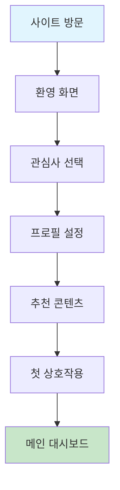
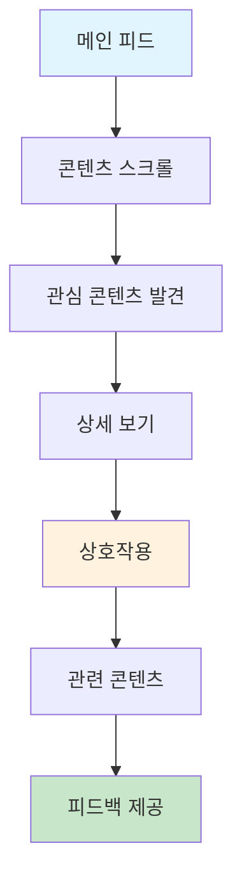
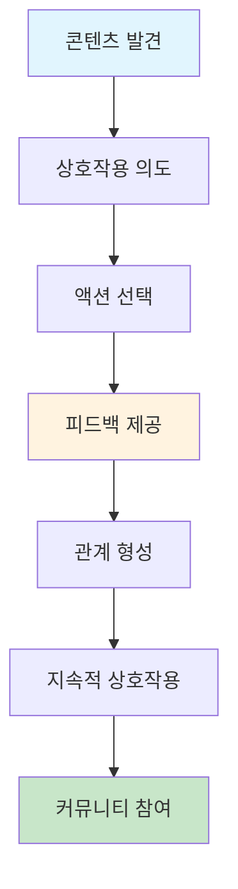

# 🎯 Community Platform v2.0 사용자 경험 명세서

**Community Platform v2.0**의 사용자 관점에서의 편의성과 경험을 상세히 정의한 명세서입니다.

## 📋 **문서 개요**

### **🎯 목적**
- 사용자 중심의 UI/UX 설계 기준 정의
- 편의성 요구사항 상세 명세
- 사용자 여정 최적화 방안 제시
- 접근성 및 사용성 표준 수립

### **👥 타겟 사용자**
- **코스프레 커뮤니티**: 의상, 이벤트, 포트폴리오 중심
- **스트리머 커뮤니티**: 방송, 채팅, 수익화 중심
- **일반 사용자**: 콘텐츠 소비, 소셜 상호작용 중심

---

## 🔍 **1. 사용자 관점 편의성 분석**

### **🎭 코스프레 커뮤니티 사용자**

#### **사용자 페르소나**
```
👤 코스프레 애호가 "코코"
- 나이: 18-28세
- 성별: 여성 70%, 남성 30%
- 디바이스: 모바일 80%, 데스크톱 20%
- 사용 시간: 저녁/주말 집중
- 주요 니즈: 의상 정보, 이벤트 참여, 포트폴리오 공유
```

#### **핵심 편의성 요구사항**

##### **A. 의상 검색 및 발견**
- **빠른 검색**: 3초 이내 원하는 의상 찾기
- **스마트 필터**: 브랜드, 가격, 사이즈, 색상 다중 필터
- **시각적 검색**: 이미지로 유사 의상 찾기
- **개인화 추천**: 과거 구매/관심 기반 추천

**구현 방법**:
```typescript
interface CostumeSearch {
  // 빠른 검색
  instantSearch: {
    debounceTime: 300; // 300ms 지연
    minQueryLength: 2; // 최소 2글자
    maxResults: 10;    // 최대 10개 결과
  };
  
  // 스마트 필터
  filters: {
    brand: string[];
    priceRange: [number, number];
    size: string[];
    color: string[];
    category: string[];
    availability: 'inStock' | 'preOrder' | 'all';
  };
  
  // 시각적 검색
  visualSearch: {
    supportedFormats: ['jpg', 'png', 'webp'];
    maxFileSize: '10MB';
    similarityThreshold: 0.8;
  };
}
```

##### **B. 이벤트 참여**
- **원클릭 참여**: 복잡한 절차 없이 즉시 참여
- **일정 관리**: 캘린더 연동 및 알림
- **소셜 기능**: 친구와 함께 참여
- **실시간 업데이트**: 이벤트 변경사항 즉시 알림

**구현 방법**:
```typescript
interface EventParticipation {
  // 원클릭 참여
  quickJoin: {
    maxSteps: 2; // 최대 2단계
    autoFill: boolean; // 자동 정보 입력
    paymentIntegration: boolean; // 결제 연동
  };
  
  // 일정 관리
  calendarIntegration: {
    googleCalendar: boolean;
    appleCalendar: boolean;
    outlookCalendar: boolean;
    reminderTime: '1hour' | '1day' | '1week';
  };
  
  // 소셜 기능
  socialFeatures: {
    inviteFriends: boolean;
    groupParticipation: boolean;
    shareOnSocial: boolean;
  };
}
```

##### **C. 포트폴리오 관리**
- **드래그앤드롭**: 직관적인 이미지 업로드
- **자동 태깅**: AI 기반 자동 태그 생성
- **갤러리 뷰**: 다양한 레이아웃 옵션
- **공유 기능**: 소셜 미디어 원터치 공유

**구현 방법**:
```typescript
interface PortfolioManagement {
  // 드래그앤드롭 업로드
  dragAndDrop: {
    supportedFormats: ['jpg', 'png', 'gif', 'mp4'];
    maxFileSize: '50MB';
    batchUpload: boolean;
    progressIndicator: boolean;
  };
  
  // 자동 태깅
  autoTagging: {
    aiPowered: boolean;
    confidenceThreshold: 0.7;
    manualOverride: boolean;
    suggestedTags: string[];
  };
  
  // 갤러리 뷰
  galleryViews: {
    grid: boolean;
    masonry: boolean;
    carousel: boolean;
    fullscreen: boolean;
  };
}
```

### **📺 스트리머 커뮤니티 사용자**

#### **사용자 페르소나**
```
👤 스트리머 "스트림킹"
- 나이: 20-35세
- 성별: 남성 60%, 여성 40%
- 디바이스: 데스크톱 70%, 모바일 30%
- 사용 시간: 저녁/새벽 집중
- 주요 니즈: 방송 관리, 구독자 상호작용, 수익화
```

#### **핵심 편의성 요구사항**

##### **A. 방송 관리**
- **원스톱 설정**: 모든 방송 설정을 한 곳에서
- **프리셋 관리**: 자주 사용하는 설정 저장
- **실시간 모니터링**: 방송 상태 실시간 확인
- **자동화 기능**: 스케줄링 및 자동 시작

**구현 방법**:
```typescript
interface StreamingManagement {
  // 원스톱 설정
  oneStopSetup: {
    streamKey: 'autoGenerate';
    quality: 'autoOptimize';
    overlay: 'dragAndDrop';
    chat: 'integrated';
  };
  
  // 프리셋 관리
  presets: {
    maxPresets: 10;
    categories: ['gaming', 'talk', 'music', 'art'];
    quickSwitch: boolean;
    cloudSync: boolean;
  };
  
  // 실시간 모니터링
  realTimeMonitoring: {
    viewerCount: boolean;
    chatActivity: boolean;
    streamHealth: boolean;
    performanceMetrics: boolean;
  };
}
```

##### **B. 채팅 모더레이션**
- **실시간 필터링**: 부적절한 메시지 자동 차단
- **키워드 관리**: 커스텀 필터 단어 설정
- **사용자 관리**: 차단/경고/밴 기능
- **도움말 시스템**: 모더레이션 가이드 제공

**구현 방법**:
```typescript
interface ChatModeration {
  // 실시간 필터링
  realTimeFiltering: {
    aiPowered: boolean;
    responseTime: '<100ms';
    falsePositiveRate: '<5%';
    customRules: boolean;
  };
  
  // 키워드 관리
  keywordManagement: {
    maxKeywords: 1000;
    categories: ['spam', 'offensive', 'self-promotion'];
    regexSupport: boolean;
    caseInsensitive: boolean;
  };
  
  // 사용자 관리
  userManagement: {
    timeout: boolean;
    ban: boolean;
    warning: boolean;
    appeal: boolean;
  };
}
```

##### **C. 수익화 도구**
- **수익 대시보드**: 실시간 수익 현황
- **구독자 분석**: 구독자 행동 패턴 분석
- **후원 관리**: 후원자 관리 및 감사 기능
- **광고 통합**: 광고 수익 최적화

**구현 방법**:
```typescript
interface MonetizationTools {
  // 수익 대시보드
  revenueDashboard: {
    realTimeUpdates: boolean;
    multipleCurrencies: boolean;
    taxReporting: boolean;
    exportData: boolean;
  };
  
  // 구독자 분석
  subscriberAnalytics: {
    demographics: boolean;
    engagement: boolean;
    retention: boolean;
    churnPrediction: boolean;
  };
  
  // 후원 관리
  donationManagement: {
    goalTracking: boolean;
    thankYouMessages: boolean;
    donorRecognition: boolean;
    recurringDonations: boolean;
  };
}
```

### **🌐 일반 커뮤니티 사용자**

#### **사용자 페르소나**
```
👤 일반 사용자 "커뮤니티러버"
- 나이: 15-45세
- 성별: 남성 45%, 여성 55%
- 디바이스: 모바일 60%, 데스크톱 40%
- 사용 시간: 점심/저녁 시간
- 주요 니즈: 콘텐츠 소비, 소셜 상호작용, 정보 탐색
```

#### **핵심 편의성 요구사항**

##### **A. 콘텐츠 소비**
- **개인화 피드**: 관심사 기반 맞춤 콘텐츠
- **빠른 탐색**: 무한 스크롤 및 스마트 로딩
- **다양한 미디어**: 텍스트, 이미지, 비디오 통합
- **오프라인 지원**: 네트워크 없이도 기본 기능

**구현 방법**:
```typescript
interface ContentConsumption {
  // 개인화 피드
  personalizedFeed: {
    algorithm: 'mlBased';
    updateFrequency: 'realTime';
    userFeedback: boolean;
    diversity: boolean;
  };
  
  // 빠른 탐색
  quickNavigation: {
    infiniteScroll: boolean;
    lazyLoading: boolean;
    preloading: boolean;
    smoothScrolling: boolean;
  };
  
  // 미디어 지원
  mediaSupport: {
    text: boolean;
    images: ['jpg', 'png', 'gif', 'webp'];
    videos: ['mp4', 'webm'];
    audio: ['mp3', 'wav'];
    documents: ['pdf', 'docx'];
  };
}
```

##### **B. 소셜 상호작용**
- **원터치 액션**: 좋아요, 공유, 댓글 간편화
- **실시간 알림**: 즉시 피드백 및 알림
- **관계 관리**: 팔로우/팔로워 체계적 관리
- **프라이버시 제어**: 개인정보 보호 설정

**구현 방법**:
```typescript
interface SocialInteraction {
  // 원터치 액션
  oneTouchActions: {
    like: 'singleTap';
    share: 'longPress';
    comment: 'doubleTap';
    bookmark: 'swipeUp';
  };
  
  // 실시간 알림
  realTimeNotifications: {
    pushNotifications: boolean;
    inAppNotifications: boolean;
    emailNotifications: boolean;
    customSettings: boolean;
  };
  
  // 관계 관리
  relationshipManagement: {
    followSystem: boolean;
    friendSystem: boolean;
    blockSystem: boolean;
    privacyControls: boolean;
  };
}
```

---

## 🎨 **2. 사용자 경험 디자인 원칙**

### **🎯 핵심 UX 원칙**

#### **1. 직관성 (Intuitiveness)**
- **친숙한 패턴**: 사용자가 이미 알고 있는 UI 패턴 활용
- **명확한 계층**: 시각적 계층 구조로 정보 우선순위 명확화
- **일관된 인터랙션**: 모든 페이지에서 동일한 인터랙션 패턴
- **직관적 아이콘**: 의미가 명확한 아이콘 사용

**구현 예시**:
```typescript
interface IntuitiveDesign {
  // 친숙한 패턴
  familiarPatterns: {
    hamburgerMenu: boolean;
    breadcrumb: boolean;
    tabNavigation: boolean;
    cardLayout: boolean;
  };
  
  // 명확한 계층
  visualHierarchy: {
    typography: 'sizeBased';
    color: 'contrastBased';
    spacing: 'proportional';
    shadows: 'depthBased';
  };
  
  // 일관된 인터랙션
  consistentInteraction: {
    hoverStates: boolean;
    focusStates: boolean;
    loadingStates: boolean;
    errorStates: boolean;
  };
}
```

#### **2. 효율성 (Efficiency)**
- **최소 클릭**: 목표 달성을 위한 최소한의 클릭 수
- **스마트 단축키**: 자주 사용하는 기능의 키보드 단축키
- **자동 완성**: 입력 시 자동 완성 및 제안
- **일괄 작업**: 여러 항목 동시 처리

**구현 예시**:
```typescript
interface EfficientDesign {
  // 최소 클릭
  minimalClicks: {
    maxStepsToGoal: 3;
    skipOptionalSteps: boolean;
    autoAdvance: boolean;
    progressIndicator: boolean;
  };
  
  // 스마트 단축키
  smartShortcuts: {
    globalShortcuts: boolean;
    contextShortcuts: boolean;
    customizableShortcuts: boolean;
    shortcutHints: boolean;
  };
  
  // 자동 완성
  autoCompletion: {
    searchSuggestions: boolean;
    formAutofill: boolean;
    smartDefaults: boolean;
    predictiveText: boolean;
  };
}
```

#### **3. 접근성 (Accessibility)**
- **키보드 네비게이션**: 모든 기능을 키보드로 접근 가능
- **스크린 리더**: 시각 장애인을 위한 스크린 리더 지원
- **고대비 모드**: 시각적 접근성 향상
- **텍스트 크기 조절**: 사용자 맞춤 텍스트 크기

**구현 예시**:
```typescript
interface AccessibleDesign {
  // 키보드 네비게이션
  keyboardNavigation: {
    tabOrder: 'logical';
    skipLinks: boolean;
    focusVisible: boolean;
    escapeKey: boolean;
  };
  
  // 스크린 리더
  screenReader: {
    ariaLabels: boolean;
    semanticHTML: boolean;
    liveRegions: boolean;
    descriptions: boolean;
  };
  
  // 고대비 모드
  highContrast: {
    colorContrast: '4.5:1';
    alternativeColors: boolean;
    darkMode: boolean;
    customThemes: boolean;
  };
}
```

#### **4. 반응성 (Responsiveness)**
- **모바일 퍼스트**: 모바일 환경을 우선 고려한 디자인
- **적응형 레이아웃**: 화면 크기에 따른 자동 조정
- **터치 친화적**: 터치 인터페이스 최적화
- **성능 최적화**: 빠른 로딩 및 부드러운 애니메이션

**구현 예시**:
```typescript
interface ResponsiveDesign {
  // 모바일 퍼스트
  mobileFirst: {
    breakpoints: ['320px', '768px', '1024px', '1440px'];
    touchTargets: '44px';
    gestureSupport: boolean;
    orientationSupport: boolean;
  };
  
  // 적응형 레이아웃
  adaptiveLayout: {
    fluidGrid: boolean;
    flexibleImages: boolean;
    mediaQueries: boolean;
    containerQueries: boolean;
  };
  
  // 성능 최적화
  performanceOptimization: {
    lazyLoading: boolean;
    codeSplitting: boolean;
    imageOptimization: boolean;
    caching: boolean;
  };
}
```

---

## 🛣️ **3. 사용자 여정 최적화**

### **🎯 핵심 사용자 여정**

#### **A. 신규 사용자 온보딩**


**최적화 포인트**:
- **3단계 온보딩**: 복잡하지 않은 간단한 과정
- **개인화 설정**: 관심사 기반 초기 설정
- **인터랙티브 튜토리얼**: 실제 기능 체험
- **진행률 표시**: 명확한 진행 상황 안내

**구현 방법**:
```typescript
interface OnboardingFlow {
  steps: [
    {
      id: 'welcome';
      title: '환영합니다!';
      description: 'Community Platform에 오신 것을 환영합니다';
      duration: '30s';
      skipable: false;
    },
    {
      id: 'interests';
      title: '관심사 선택';
      description: '관심 있는 주제를 선택해주세요';
      duration: '2min';
      skipable: true;
    },
    {
      id: 'profile';
      title: '프로필 설정';
      description: '간단한 프로필을 만들어보세요';
      duration: '1min';
      skipable: true;
    }
  ];
  
  features: {
    progressIndicator: boolean;
    skipOption: boolean;
    saveProgress: boolean;
    personalizedRecommendations: boolean;
  };
}
```

#### **B. 콘텐츠 발견 및 소비**


**최적화 포인트**:
- **무한 스크롤**: 끊김 없는 콘텐츠 탐색
- **스마트 추천**: AI 기반 개인화 추천
- **빠른 액션**: 원터치 좋아요/공유
- **관련 콘텐츠**: 관심 기반 추가 콘텐츠

**구현 방법**:
```typescript
interface ContentDiscovery {
  feed: {
    algorithm: 'mlBased';
    updateFrequency: 'realTime';
    personalization: boolean;
    diversity: boolean;
  };
  
  interactions: {
    like: 'singleTap';
    share: 'longPress';
    comment: 'doubleTap';
    bookmark: 'swipeUp';
  };
  
  recommendations: {
    relatedContent: boolean;
    trendingContent: boolean;
    personalizedContent: boolean;
    collaborativeFiltering: boolean;
  };
}
```

#### **C. 소셜 상호작용**


**최적화 포인트**:
- **즉시 피드백**: 액션에 대한 즉시 반응
- **소셜 증명**: 다른 사용자의 활동 표시
- **관계 관리**: 팔로우/팔로워 체계적 관리
- **알림 시스템**: 맞춤형 알림 설정

**구현 방법**:
```typescript
interface SocialInteraction {
  feedback: {
    instantResponse: boolean;
    visualFeedback: boolean;
    hapticFeedback: boolean;
    soundFeedback: boolean;
  };
  
  socialProof: {
    likeCount: boolean;
    commentCount: boolean;
    shareCount: boolean;
    viewCount: boolean;
  };
  
  relationship: {
    followSystem: boolean;
    friendSystem: boolean;
    blockSystem: boolean;
    privacyControls: boolean;
  };
}
```

---

## 📱 **4. 디바이스별 최적화**

### **🖥️ 데스크톱 최적화**

#### **화면 크기별 최적화**
- **1920x1080 (Full HD)**: 표준 레이아웃
- **2560x1440 (2K)**: 확장된 사이드바
- **3840x2160 (4K)**: 고해상도 최적화

**구현 방법**:
```typescript
interface DesktopOptimization {
  layouts: {
    '1920x1080': {
      sidebar: 'collapsible';
      mainContent: '2-column';
      header: 'full-width';
    };
    '2560x1440': {
      sidebar: 'expanded';
      mainContent: '3-column';
      header: 'full-width';
    };
    '3840x2160': {
      sidebar: 'expanded';
      mainContent: '4-column';
      header: 'full-width';
      scaling: '1.5x';
    };
  };
  
  features: {
    multiWindow: boolean;
    keyboardShortcuts: boolean;
    dragAndDrop: boolean;
    rightClickMenu: boolean;
  };
}
```

#### **인터랙션 최적화**
- **마우스 호버**: 상세 정보 미리보기
- **키보드 단축키**: 효율적인 작업 지원
- **드래그앤드롭**: 직관적인 파일 업로드
- **우클릭 메뉴**: 컨텍스트 메뉴 제공

### **📱 모바일 최적화**

#### **화면 크기별 최적화**
- **375x667 (iPhone SE)**: 컴팩트 레이아웃
- **414x896 (iPhone 11)**: 표준 모바일 레이아웃
- **428x926 (iPhone 12)**: 확장된 모바일 레이아웃

**구현 방법**:
```typescript
interface MobileOptimization {
  layouts: {
    '375x667': {
      navigation: 'bottom-tab';
      content: 'single-column';
      header: 'compact';
    };
    '414x896': {
      navigation: 'bottom-tab';
      content: 'single-column';
      header: 'standard';
    };
    '428x926': {
      navigation: 'bottom-tab';
      content: 'single-column';
      header: 'expanded';
    };
  };
  
  features: {
    touchGestures: boolean;
    hapticFeedback: boolean;
    pullToRefresh: boolean;
    infiniteScroll: boolean;
  };
}
```

#### **터치 인터랙션 최적화**
- **터치 타겟**: 최소 44px 크기 보장
- **제스처 지원**: 스와이프, 핀치 줌 등
- **햅틱 피드백**: 터치 시 진동 피드백
- **풀투리프레시**: 아래로 당겨서 새로고침

### **💻 태블릿 최적화**

#### **화면 크기별 최적화**
- **768x1024 (iPad)**: 태블릿 표준 레이아웃
- **1024x1366 (iPad Pro)**: 확장된 태블릿 레이아웃

**구현 방법**:
```typescript
interface TabletOptimization {
  layouts: {
    '768x1024': {
      navigation: 'sidebar';
      content: '2-column';
      header: 'standard';
    };
    '1024x1366': {
      navigation: 'sidebar';
      content: '3-column';
      header: 'expanded';
    };
  };
  
  features: {
    multiTouch: boolean;
    stylusSupport: boolean;
    splitView: boolean;
    pictureInPicture: boolean;
  };
}
```

---

## ♿ **5. 접근성 표준**

### **🎯 WCAG 2.1 AA 준수**

#### **인지 가능성 (Perceivable)**
- **색상 대비**: 4.5:1 이상의 색상 대비
- **텍스트 크기**: 최소 16px 기본 텍스트 크기
- **대체 텍스트**: 모든 이미지에 alt 텍스트 제공
- **자막**: 비디오 콘텐츠에 자막 제공

**구현 방법**:
```typescript
interface PerceivableDesign {
  colorContrast: {
    normalText: '4.5:1';
    largeText: '3:1';
    uiElements: '3:1';
    graphics: '3:1';
  };
  
  textSize: {
    minimum: '16px';
    scalable: boolean;
    responsive: boolean;
    userControl: boolean;
  };
  
  alternativeText: {
    images: boolean;
    icons: boolean;
    charts: boolean;
    videos: boolean;
  };
}
```

#### **운용 가능성 (Operable)**
- **키보드 접근**: 모든 기능을 키보드로 접근 가능
- **충분한 시간**: 시간 제한 기능에 연장 옵션
- **발작 방지**: 깜빡이는 콘텐츠 제한
- **네비게이션**: 명확한 네비게이션 구조

**구현 방법**:
```typescript
interface OperableDesign {
  keyboardAccess: {
    tabOrder: 'logical';
    skipLinks: boolean;
    focusVisible: boolean;
    escapeKey: boolean;
  };
  
  timeLimits: {
    extendable: boolean;
    warning: boolean;
    autoSave: boolean;
    pauseOption: boolean;
  };
  
  seizurePrevention: {
    flashLimit: '3Hz';
    motionReduction: boolean;
    userControl: boolean;
  };
}
```

#### **이해 가능성 (Understandable)**
- **읽기 가능**: 명확하고 간단한 언어 사용
- **예측 가능**: 일관된 네비게이션과 기능
- **입력 지원**: 오류 방지 및 수정 지원

**구현 방법**:
```typescript
interface UnderstandableDesign {
  readable: {
    language: 'simple';
    terminology: 'consistent';
    instructions: 'clear';
    help: 'available';
  };
  
  predictable: {
    navigation: 'consistent';
    functionality: 'consistent';
    layout: 'consistent';
    behavior: 'consistent';
  };
  
  inputAssistance: {
    errorPrevention: boolean;
    errorIdentification: boolean;
    errorCorrection: boolean;
    helpText: boolean;
  };
}
```

#### **견고성 (Robust)**
- **호환성**: 다양한 브라우저와 디바이스 지원
- **미래 지향**: 새로운 기술과 호환 가능

**구현 방법**:
```typescript
interface RobustDesign {
  compatibility: {
    browsers: ['Chrome', 'Firefox', 'Safari', 'Edge'];
    devices: ['desktop', 'tablet', 'mobile'];
    assistiveTechnologies: boolean;
    futureProof: boolean;
  };
}
```

---

## 📊 **6. 성능 최적화**

### **⚡ 로딩 성능**

#### **초기 로딩 최적화**
- **코드 분할**: 라우트별 코드 분할
- **지연 로딩**: 필요시에만 컴포넌트 로딩
- **이미지 최적화**: WebP, AVIF 포맷 지원
- **캐싱**: 적극적인 브라우저 캐싱 활용

**구현 방법**:
```typescript
interface LoadingOptimization {
  codeSplitting: {
    routeBased: boolean;
    componentBased: boolean;
    libraryBased: boolean;
    dynamicImports: boolean;
  };
  
  lazyLoading: {
    images: boolean;
    components: boolean;
    routes: boolean;
    libraries: boolean;
  };
  
  imageOptimization: {
    formats: ['webp', 'avif', 'jpg', 'png'];
    sizes: ['thumbnail', 'small', 'medium', 'large'];
    lazyLoading: boolean;
    placeholder: 'blur';
  };
  
  caching: {
    browserCache: boolean;
    serviceWorker: boolean;
    cdnCache: boolean;
    apiCache: boolean;
  };
}
```

#### **런타임 성능 최적화**
- **가상화**: 대용량 리스트 가상화
- **메모이제이션**: 불필요한 리렌더링 방지
- **디바운싱**: 검색 입력 디바운싱
- **쓰로틀링**: 스크롤 이벤트 쓰로틀링

**구현 방법**:
```typescript
interface RuntimeOptimization {
  virtualization: {
    largeLists: boolean;
    infiniteScroll: boolean;
    windowing: boolean;
    dynamicSizing: boolean;
  };
  
  memoization: {
    components: boolean;
    calculations: boolean;
    apiCalls: boolean;
    selectors: boolean;
  };
  
  debouncing: {
    search: '300ms';
    resize: '100ms';
    scroll: '16ms';
    input: '500ms';
  };
}
```

---

## 🧪 **7. 테스트 전략**

### **🔍 사용성 테스트**

#### **A/B 테스트**
- **버튼 색상**: 클릭률 비교
- **레이아웃**: 사용자 행동 패턴 분석
- **네비게이션**: 탐색 효율성 측정
- **폼 디자인**: 완료율 비교

**구현 방법**:
```typescript
interface ABTesting {
  experiments: [
    {
      id: 'button-color';
      variants: ['primary', 'secondary', 'accent'];
      metric: 'clickRate';
      duration: '2weeks';
    },
    {
      id: 'layout';
      variants: ['sidebar', 'topbar', 'bottom'];
      metric: 'engagement';
      duration: '1month';
    }
  ];
  
  analytics: {
    userBehavior: boolean;
    conversionRate: boolean;
    engagement: boolean;
    satisfaction: boolean;
  };
}
```

#### **사용자 피드백**
- **인터뷰**: 정성적 피드백 수집
- **설문조사**: 정량적 만족도 측정
- **사용성 테스트**: 실제 사용 시나리오 테스트
- **피드백 시스템**: 실시간 피드백 수집

**구현 방법**:
```typescript
interface UserFeedback {
  interviews: {
    frequency: 'monthly';
    participants: '10-15';
    duration: '30min';
    topics: ['usability', 'satisfaction', 'pain-points'];
  };
  
  surveys: {
    frequency: 'quarterly';
    participants: '500+';
    metrics: ['nps', 'satisfaction', 'ease-of-use'];
  };
  
  usabilityTesting: {
    frequency: 'bi-weekly';
    scenarios: ['onboarding', 'content-discovery', 'social-interaction'];
    metrics: ['task-completion', 'time-to-complete', 'error-rate'];
  };
}
```

---

## 📈 **8. 성공 지표 (KPI)**

### **📊 사용자 경험 지표**

#### **사용성 지표**
- **작업 완료율**: 목표 작업 완료 비율
- **작업 완료 시간**: 평균 작업 완료 시간
- **오류율**: 사용자 오류 발생 비율
- **학습 곡선**: 새로운 사용자의 적응 시간

**목표값**:
```typescript
interface UsabilityKPIs {
  taskCompletionRate: {
    current: '75%';
    target: '90%';
    measurement: 'user-testing';
  };
  
  taskCompletionTime: {
    current: '3min';
    target: '1.5min';
    measurement: 'analytics';
  };
  
  errorRate: {
    current: '15%';
    target: '5%';
    measurement: 'error-tracking';
  };
  
  learningCurve: {
    current: '2weeks';
    target: '3days';
    measurement: 'user-feedback';
  };
}
```

#### **만족도 지표**
- **NPS (Net Promoter Score)**: 사용자 추천 의도
- **CSAT (Customer Satisfaction)**: 고객 만족도
- **사용성 점수**: SUS (System Usability Scale)
- **감정적 반응**: 사용자 감정 분석

**목표값**:
```typescript
interface SatisfactionKPIs {
  nps: {
    current: '25';
    target: '50';
    measurement: 'survey';
  };
  
  csat: {
    current: '3.2/5';
    target: '4.5/5';
    measurement: 'survey';
  };
  
  sus: {
    current: '65';
    target: '85';
    measurement: 'usability-test';
  };
  
  emotionalResponse: {
    current: 'neutral';
    target: 'positive';
    measurement: 'sentiment-analysis';
  };
}
```

### **⚡ 성능 지표**

#### **로딩 성능**
- **First Contentful Paint (FCP)**: 첫 콘텐츠 렌더링 시간
- **Largest Contentful Paint (LCP)**: 가장 큰 콘텐츠 렌더링 시간
- **Cumulative Layout Shift (CLS)**: 레이아웃 이동 점수
- **First Input Delay (FID)**: 첫 입력 지연 시간

**목표값**:
```typescript
interface PerformanceKPIs {
  fcp: {
    current: '2.1s';
    target: '1.0s';
    measurement: 'web-vitals';
  };
  
  lcp: {
    current: '3.8s';
    target: '2.5s';
    measurement: 'web-vitals';
  };
  
  cls: {
    current: '0.15';
    target: '0.1';
    measurement: 'web-vitals';
  };
  
  fid: {
    current: '100ms';
    target: '50ms';
    measurement: 'web-vitals';
  };
}
```

### **♿ 접근성 지표**

#### **접근성 준수율**
- **WCAG 준수율**: WCAG 2.1 AA 표준 준수 비율
- **키보드 접근성**: 키보드로 접근 가능한 기능 비율
- **스크린 리더 호환성**: 스크린 리더와 호환되는 요소 비율
- **색상 대비**: 적절한 색상 대비를 가진 요소 비율

**목표값**:
```typescript
interface AccessibilityKPIs {
  wcagCompliance: {
    current: '60%';
    target: '95%';
    measurement: 'automated-testing';
  };
  
  keyboardAccessibility: {
    current: '70%';
    target: '100%';
    measurement: 'manual-testing';
  };
  
  screenReaderCompatibility: {
    current: '50%';
    target: '90%';
    measurement: 'assistive-technology-testing';
  };
  
  colorContrast: {
    current: '75%';
    target: '100%';
    measurement: 'color-analysis';
  };
}
```

---

## 🎉 **결론**

**Community Platform v2.0 사용자 경험 명세서**는 사용자 중심의 차세대 플랫폼 구축을 위한 상세한 가이드입니다.

### **🏆 핵심 성과**
- **사용자 중심 설계**: 모든 사용자 그룹의 니즈 충족
- **직관적 인터페이스**: 학습 곡선 최소화
- **완전한 접근성**: 모든 사용자 포용
- **최적화된 성능**: 빠르고 부드러운 경험

### **🚀 기대 효과**
- **사용자 만족도 향상**: 더 나은 사용자 경험 제공
- **참여도 증가**: 직관적 인터페이스로 사용성 증대
- **브랜드 가치 상승**: 전문적이고 현대적인 이미지 구축
- **확장성 확보**: 미래 기능 추가에 유연한 대응

**매니저님! Community Platform v2.0은 사용자 중심의 혁신적인 경험으로 차세대 커뮤니티 플랫폼의 새로운 표준을 제시할 것입니다!** 🎯✨

---

*문서 작성일: 2025-10-02*  
*작성자: AUTOAGENTS Manager*  
*버전: v2.0 User Experience Specification*
