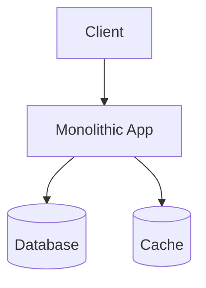

# 🏗️ 아키텍처 설계 보고서

## 📋 프로젝트 개요
- **타입**: blog
- **스케일**: small
- **클라우드**: azure
- **아키텍처 패턴**: monolith

## 🎯 아키텍처 개요
단일 애플리케이션으로 구성된 아키텍처

### 장점
- 단순성
- 개발 속도
- 디버깅 용이
- 배포 간단

### 단점
- 확장성 제한
- 기술 제약
- 팀 의존성
- 장애 전파

## 🧩 컴포넌트 설계

### Monolithic Application
- **타입**: service
- **기술 스택**: typescript, express, node.js, postgresql
- **책임**: 모든 비즈니스 로직, API 제공, 데이터 처리
- **스케일링**: horizontal (1-3)

## 🔄 데이터 플로우

## 🚀 배포 계획
- **전략**: blue-green
- **클라우드**: azure
- **리전**: us-central1, europe-west1
- **환경**: production, staging

## 🔒 보안 설계
- **인증**: oauth2
- **암호화**: At Rest / In Transit
- **네트워크**: VPC 사용

## 📊 모니터링 계획
- **메트릭**: response_time, error_rate, cpu_usage, memory_usage
- **로깅**: info 레벨
- **대시보드**: overview, performance

## 💰 비용 추정
- **월 비용**: $220
- **연 비용**: $2640
- **인프라**: $132
- **개발**: $44
- **유지보수**: $33

## ⏰ 타임라인
- **총 기간**: 8주
- **개발**: 2주
- **테스트**: 2주
- **배포**: 2주

## ⚠️ 위험 요소

### 예상보다 높은 트래픽으로 인한 성능 저하
- **확률**: medium
- **영향**: high
- **완화책**: 자동 스케일링 설정, 로드 테스트 수행
- **대응책**: 수동 스케일링, CDN 활용

### 보안 취약점으로 인한 데이터 유출
- **확률**: low
- **영향**: high
- **완화책**: 정기 보안 감사, 침입 탐지 시스템
- **대응책**: 사고 대응 계획, 데이터 백업

## 💡 권장사항

## 📈 아키텍처 다이어그램

