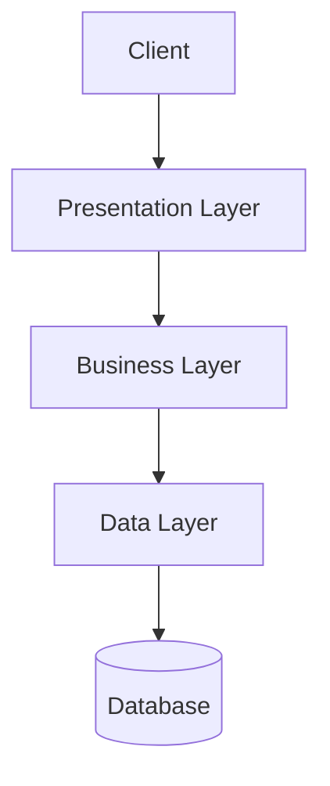

# 🏗️ 아키텍처 설계 보고서

## 📋 프로젝트 개요
- **타입**: ecommerce
- **스케일**: medium
- **클라우드**: aws
- **아키텍처 패턴**: layered

## 🎯 아키텍처 개요
계층별로 분리된 아키텍처

### 장점
- 명확한 책임
- 재사용성
- 테스트 용이
- 유지보수성

### 단점
- 성능 오버헤드
- 유연성 제한
- 계층 간 의존성

## 🧩 컴포넌트 설계

## 🔄 데이터 플로우

## 🚀 배포 계획
- **전략**: blue-green
- **클라우드**: aws
- **리전**: us-east-1, us-west-2
- **환경**: production, staging

## 🔒 보안 설계
- **인증**: oauth2
- **암호화**: At Rest / In Transit
- **네트워크**: VPC 사용

## 📊 모니터링 계획
- **메트릭**: response_time, error_rate, cpu_usage, memory_usage
- **로깅**: info 레벨
- **대시보드**: overview, performance

## 💰 비용 추정
- **월 비용**: $500
- **연 비용**: $6000
- **인프라**: $300
- **개발**: $100
- **유지보수**: $75

## ⏰ 타임라인
- **총 기간**: 16주
- **개발**: 10주
- **테스트**: 2주
- **배포**: 2주

## ⚠️ 위험 요소

### 예상보다 높은 트래픽으로 인한 성능 저하
- **확률**: medium
- **영향**: high
- **완화책**: 자동 스케일링 설정, 로드 테스트 수행
- **대응책**: 수동 스케일링, CDN 활용

### 보안 취약점으로 인한 데이터 유출
- **확률**: low
- **영향**: high
- **완화책**: 정기 보안 감사, 침입 탐지 시스템
- **대응책**: 사고 대응 계획, 데이터 백업

## 💡 권장사항

### 컨테이너 오케스트레이션 도입
- **우선순위**: medium
- **근거**: 배포 자동화 및 리소스 최적화
- **구현**: Kubernetes 클러스터 구축
- **노력**: medium
- **영향**: medium

## 📈 아키텍처 다이어그램

