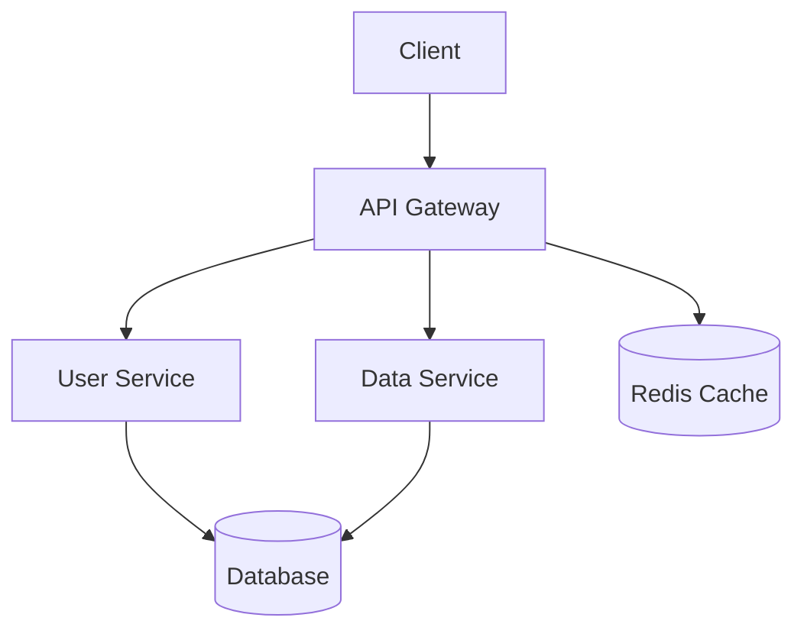

# 🏗️ 아키텍처 설계 보고서

## 📋 프로젝트 개요
- **타입**: social
- **스케일**: large
- **클라우드**: gcp
- **아키텍처 패턴**: microservices

## 🎯 아키텍처 개요
독립적인 서비스들의 집합으로 구성된 아키텍처

### 장점
- 확장성
- 기술 다양성
- 팀 독립성
- 장애 격리

### 단점
- 복잡성
- 네트워크 지연
- 데이터 일관성
- 운영 복잡성

## 🧩 컴포넌트 설계

### API Gateway
- **타입**: gateway
- **기술 스택**: typescript, express, node.js, redis
- **책임**: 라우팅, 인증, 로드 밸런싱, 레이트 리미팅
- **스케일링**: horizontal (2-10)

### User Service
- **타입**: service
- **기술 스택**: typescript, express, node.js, postgresql
- **책임**: 사용자 등록, 인증, 프로필 관리
- **스케일링**: horizontal (2-5)

### Post Service
- **타입**: service
- **기술 스택**: typescript, express, node.js, postgresql
- **책임**: 게시물 작성, 좋아요, 공유
- **스케일링**: horizontal (3-10)

### Messaging Service
- **타입**: service
- **기술 스택**: typescript, socket.io, node.js, redis
- **책임**: 1:1 채팅, 그룹 채팅, 실시간 알림
- **스케일링**: horizontal (3-15)

### PostgreSQL Database
- **타입**: database
- **기술 스택**: sql, postgresql, postgresql, postgresql
- **책임**: 데이터 저장, 트랜잭션 관리, 백업
- **스케일링**: vertical (1-1)

### Redis Cache
- **타입**: cache
- **기술 스택**: javascript, redis, redis, redis
- **책임**: 세션 저장, 캐시 데이터, 실시간 데이터
- **스케일링**: horizontal (1-3)

## 🔄 데이터 플로우

### Client to Gateway
- **소스**: client
- **대상**: api-gateway
- **데이터**: HTTP requests
- **프로토콜**: HTTPS
- **빈도**: real-time
- **볼륨**: 1000
- **중요도**: high

### Gateway to User Service
- **소스**: api-gateway
- **대상**: user-service
- **데이터**: API requests
- **프로토콜**: HTTP
- **빈도**: real-time
- **볼륨**: 500
- **중요도**: high

### Gateway to Post Service
- **소스**: api-gateway
- **대상**: post-service
- **데이터**: API requests
- **프로토콜**: HTTP
- **빈도**: real-time
- **볼륨**: 500
- **중요도**: high

### Gateway to Messaging Service
- **소스**: api-gateway
- **대상**: messaging-service
- **데이터**: API requests
- **프로토콜**: HTTP
- **빈도**: real-time
- **볼륨**: 500
- **중요도**: high

## 🚀 배포 계획
- **전략**: blue-green
- **클라우드**: gcp
- **리전**: us-central1, europe-west1
- **환경**: production, staging

## 🔒 보안 설계
- **인증**: oauth2
- **암호화**: At Rest / In Transit
- **네트워크**: VPC 사용

## 📊 모니터링 계획
- **메트릭**: response_time, error_rate, cpu_usage, memory_usage
- **로깅**: info 레벨
- **대시보드**: overview, performance

## 💰 비용 추정
- **월 비용**: $3420
- **연 비용**: $41040
- **인프라**: $2052
- **개발**: $684
- **유지보수**: $513

## ⏰ 타임라인
- **총 기간**: 24주
- **개발**: 18주
- **테스트**: 2주
- **배포**: 2주

## ⚠️ 위험 요소

### 예상보다 높은 트래픽으로 인한 성능 저하
- **확률**: high
- **영향**: high
- **완화책**: 자동 스케일링 설정, 로드 테스트 수행
- **대응책**: 수동 스케일링, CDN 활용

### 보안 취약점으로 인한 데이터 유출
- **확률**: low
- **영향**: high
- **완화책**: 정기 보안 감사, 침입 탐지 시스템
- **대응책**: 사고 대응 계획, 데이터 백업

### 마이크로서비스 복잡성으로 인한 운영 어려움
- **확률**: medium
- **영향**: medium
- **완화책**: 모니터링 강화, 문서화, 팀 교육
- **대응책**: 단순화, 전문가 고용

## 💡 권장사항

### 컨테이너 오케스트레이션 도입
- **우선순위**: medium
- **근거**: 배포 자동화 및 리소스 최적화
- **구현**: Kubernetes 클러스터 구축
- **노력**: medium
- **영향**: medium

### CDN 및 캐싱 전략 도입
- **우선순위**: high
- **근거**: 실시간 성능 향상
- **구현**: CloudFront + Redis 캐시
- **노력**: low
- **영향**: high

## 📈 아키텍처 다이어그램

