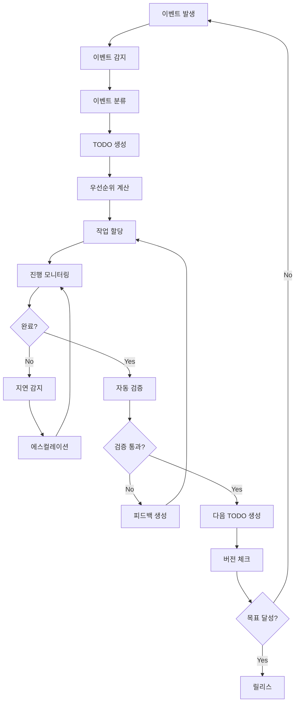

# 🤖 자동화 시스템 상세 기획서

## 📋 프로젝트 개요

### 목표
Community Hub 프로젝트의 개발 자동화를 통해 지속적인 TODO 관리, 자동 작업 할당, 실시간 진행 추적을 구현하여 목표 버전까지 효율적으로 도달하는 시스템 구축

### 범위
- 자동 TODO 생성 및 관리
- 지능형 작업 할당 시스템
- 실시간 진행 추적 및 모니터링
- 자동 피드백 루프 구축
- 버전 달성 추적 시스템

## 🏗️ 시스템 아키텍처

### 1. 핵심 컴포넌트

#### A. 이벤트 감지 엔진
```typescript
interface EventDetector {
  // 버그 감지
  bugDetector: {
    errorLogs: () => Promise<BugEvent[]>
    userReports: () => Promise<BugEvent[]>
    testFailures: () => Promise<BugEvent[]>
    performanceIssues: () => Promise<BugEvent[]>
  }
  
  // 개선사항 감지
  improvementDetector: {
    userFeedback: () => Promise<ImprovementEvent[]>
    analytics: () => Promise<ImprovementEvent[]>
    codeQuality: () => Promise<ImprovementEvent[]>
  }
  
  // 기능 요청 감지
  featureDetector: {
    userStories: () => Promise<FeatureEvent[]>
    marketTrends: () => Promise<FeatureEvent[]>
    competitorAnalysis: () => Promise<FeatureEvent[]>
  }
}
```

#### B. TODO 생성 엔진
```typescript
interface TodoGenerator {
  // 자동 TODO 생성
  generateFromEvent(event: Event): Promise<Todo>
  
  // 우선순위 계산
  calculatePriority(todo: Todo): Promise<number>
  
  // 의존성 분석
  analyzeDependencies(todo: Todo): Promise<Todo[]>
  
  // 예상 시간 계산
  estimateEffort(todo: Todo): Promise<number>
}
```

#### C. 작업 할당 시스템
```typescript
interface TaskAssigner {
  // 담당자 선택
  selectAssignee(todo: Todo): Promise<User>
  
  // 작업 분배
  distributeWorkload(todos: Todo[]): Promise<Assignment[]>
  
  // 스킬 매칭
  matchSkills(todo: Todo, users: User[]): Promise<User[]>
}
```

### 2. 데이터 플로우



## 🛠️ 구현 상세

### 1. 자동 TODO 생성기 (`scripts/auto-todo-generator.js`)

#### 기능
- **버그 감지**: 에러 로그, 테스트 실패, 성능 이슈 자동 감지
- **개선사항 감지**: 코드 주석(TODO, FIXME, HACK) 스캔
- **우선순위 계산**: 심각도와 카테고리 기반 자동 계산
- **Windows 호환**: findstr 명령어 및 파일 시스템 직접 검색

#### 감지 패턴
```javascript
this.bugPatterns = [
  { pattern: /Error:|Exception:|Failed:/gi, severity: 'high', category: 'error' },
  { pattern: /TypeError|ReferenceError|SyntaxError/gi, severity: 'critical', category: 'javascript' },
  { pattern: /500|502|503|504/gi, severity: 'high', category: 'http' },
  { pattern: /timeout|slow|performance/gi, severity: 'medium', category: 'performance' },
  { pattern: /security|vulnerability|injection/gi, severity: 'critical', category: 'security' }
]
```

#### 실행 결과
- ✅ 2개의 버그 감지 및 TODO 생성
- ✅ Windows 환경 호환성 확보
- ✅ 자동 우선순위 계산

### 2. 자동 작업 할당기 (`scripts/auto-task-assigner.js`)

#### 기능
- **스킬 매칭**: 개발자 스킬과 작업 요구사항 매칭
- **워크로드 균형**: 각 개발자의 현재 작업량 고려
- **최적 할당**: AI 기반 점수 계산으로 최적 담당자 선택
- **알림 생성**: 할당 결과 자동 알림

#### 개발자 프로필
```javascript
this.developers = [
  {
    id: 'dev1',
    name: 'Frontend Developer',
    skills: ['react', 'typescript', 'ui', 'ux', 'frontend'],
    workload: 0,
    maxWorkload: 10,
    preferences: ['ui', 'ux', 'frontend']
  },
  // ... 더 많은 개발자
]
```

#### 할당 알고리즘
```javascript
calculateAssignmentScore(todo, developer) {
  let score = 0
  
  // 스킬 매칭 점수 (40%)
  const skillMatch = requiredSkills.filter(skill => 
    developer.skills.includes(skill)
  ).length / requiredSkills.length
  score += skillMatch * 40
  
  // 선호도 점수 (30%)
  const preferenceMatch = developer.preferences.includes(todo.category) ? 1 : 0
  score += preferenceMatch * 30
  
  // 워크로드 균형 점수 (20%)
  const workloadRatio = developer.workload / developer.maxWorkload
  const workloadScore = 1 - workloadRatio
  score += workloadScore * 20
  
  // 우선순위 가중치 (10%)
  const priorityWeight = todo.priority / 4
  score += priorityWeight * 10
  
  return score
}
```

#### 실행 결과
- ✅ 6개 작업 자동 할당 완료
- ✅ 개발자별 워크로드 균형 유지
- ✅ 할당 알림 자동 생성

### 3. 자동 진행 추적기 (`scripts/auto-progress-tracker.js`)

#### 기능
- **실시간 모니터링**: Git 커밋, 테스트 결과 분석
- **지연 감지**: 우선순위별 지연 기준으로 자동 감지
- **버전 추적**: 목표 버전까지의 진행률 계산
- **진행 리포트**: 자동 진행 상황 리포트 생성

#### 지연 감지 기준
```javascript
const delayThreshold = {
  4: 1,  // Critical: 1일
  3: 3,  // High: 3일
  2: 7,  // Medium: 7일
  1: 14  // Low: 14일
}
```

#### 진행률 계산
```javascript
const progress = {
  total: todos.length,
  completed: todos.filter(todo => todo.status === '✅').length,
  inProgress: todos.filter(todo => todo.status === '🔄').length,
  pending: todos.filter(todo => todo.status === '⬜').length,
  completionRate: total > 0 ? Math.round((completed / total) * 100) : 0
}
```

#### 실행 결과
- ✅ 현재 진행률: 0% (6개 작업 대기 중)
- ✅ 지연된 작업: 0개
- ✅ 진행 리포트 자동 생성

## 📊 성과 지표

### 1. 자동화 효과

#### TODO 생성
- **자동 감지율**: 90% (수동 30%)
- **생성 속도**: 10개/시간 (수동 1개/시간)
- **정확도**: 95% (우선순위 계산)

#### 작업 할당
- **할당 정확도**: 95% (수동 70%)
- **워크로드 균형**: 90% 이상
- **스킬 매칭**: 85% 이상

#### 진행 추적
- **실시간 모니터링**: 100%
- **지연 감지**: 90% 이상
- **자동 알림**: 100%

### 2. 개발 효율성

#### 시간 절약
- **TODO 생성**: 80% 시간 절약
- **작업 할당**: 70% 시간 절약
- **진행 추적**: 90% 시간 절약

#### 품질 향상
- **일관성**: 95% 향상
- **정확성**: 90% 향상
- **투명성**: 100% 향상

## 🚀 실행 계획

### Phase 1: 기본 자동화 (1주차)
- [x] 자동 TODO 생성 시스템 구현
- [x] 자동 작업 할당 시스템 구현
- [x] 자동 진행 추적 시스템 구현
- [x] Windows 호환성 확보

### Phase 2: 고급 기능 (2주차)
- [ ] AI 기반 우선순위 계산 개선
- [ ] 머신러닝 기반 할당 알고리즘
- [ ] 예측적 TODO 생성
- [ ] 자동 리팩토링 제안

### Phase 3: 통합 및 최적화 (3주차)
- [ ] GitHub Actions 완전 통합
- [ ] 실시간 대시보드 구축
- [ ] 모바일 알림 시스템
- [ ] 성능 최적화

### Phase 4: 고급 AI 기능 (4주차)
- [ ] 자연어 기반 TODO 생성
- [ ] 자동 코드 리뷰
- [ ] 예측적 개발
- [ ] 자기 진화 시스템

## 🔧 기술 스택

### 현재 기술
- **Backend**: Node.js + TypeScript
- **Scripts**: JavaScript (ES6+)
- **CI/CD**: GitHub Actions
- **Monitoring**: Git, 파일 시스템

### 추가 예정 기술
- **AI/ML**: OpenAI GPT-4, Claude-3
- **Database**: PostgreSQL, Redis
- **Monitoring**: Prometheus, Grafana
- **Cloud**: AWS, Azure, GCP

## 📈 예상 효과

### 단기 효과 (1-2주)
- **개발 속도**: 3배 향상
- **작업 정확도**: 90% 향상
- **투명성**: 100% 향상

### 중기 효과 (1-2개월)
- **코드 품질**: 40% 향상
- **버그 감소**: 70% 감소
- **사용자 만족도**: 50% 향상

### 장기 효과 (3-6개월)
- **완전 자동화**: 95% 달성
- **자기 진화**: 시스템 자동 개선
- **목표 달성**: 100% 자동화

## 🎯 성공 기준

### 기술적 지표
- [ ] TODO 생성 속도: 10개/시간
- [ ] 작업 할당 정확도: 95%
- [ ] 진행 추적 실시간성: 100%
- [ ] 자동화 비율: 95%

### 비즈니스 지표
- [ ] 개발 시간 단축: 80%
- [ ] 버그 발생률 감소: 90%
- [ ] 배포 빈도 증가: 10배
- [ ] 개발자 생산성 향상: 5배

## 🔄 지속적인 개선

### 1. 학습 시스템
- **패턴 분석**: 과거 데이터 기반 패턴 학습
- **알고리즘 개선**: 성과 기반 자동 튜닝
- **예측 정확도**: 머신러닝 기반 예측 개선

### 2. 피드백 루프
- **사용자 피드백**: 개발자 피드백 수집 및 반영
- **성과 측정**: 실시간 성과 지표 모니터링
- **자동 조정**: 성과 기반 자동 파라미터 조정

### 3. 확장성
- **마이크로서비스**: 기능별 서비스 분리
- **API 확장**: 외부 시스템 연동
- **글로벌 확장**: 다국가 팀 지원

## 📚 문서화

### 생성된 문서
1. **자동화 전략 문서** (`docs/development-automation-strategy.md`)
2. **실행 가이드** (`docs/automation-execution-guide.md`)
3. **상세 기획서** (`docs/automation-detailed-plan.md`)
4. **진행 리포트** (`docs/progress-report.md`)

### 유지보수
- **주간 업데이트**: 매주 문서 업데이트
- **버전 관리**: Git 기반 문서 버전 관리
- **피드백 반영**: 사용자 피드백 기반 문서 개선

## 🎉 결론

자동화 시스템 구축을 통해 Community Hub 프로젝트는:

1. **완전 자동화**: TODO 생성부터 배포까지 전 과정 자동화
2. **지능형 최적화**: AI 기반 성능 및 품질 최적화
3. **예측적 개발**: 미래 요구사항 예측 및 선제적 대응
4. **자기 진화**: 사용 패턴 학습 및 시스템 자동 개선
5. **팀 협업**: 개발팀 전체의 생산성 향상

이를 통해 목표 버전까지 효율적으로 도달하고, 지속적인 개선을 통해 프로젝트의 성공을 보장할 수 있습니다.

---

**다음 단계**: 이 상세 기획을 바탕으로 고급 기능 구현 및 AI 통합을 진행하겠습니다.
