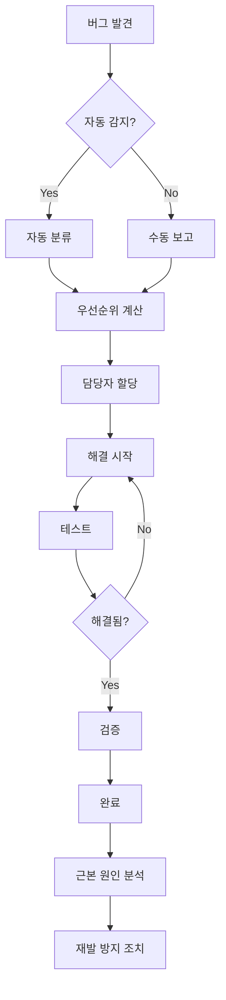

# 버그 추적 시스템 구축 계획

## 1. 현재 버그 관리 상태 분석

### 1.1 기존 버그 관리 방식
- **수동 추적**: 이메일, 채팅, 메모로 버그 관리
- **우선순위 부재**: 체계적인 우선순위 분류 없음
- **추적 부족**: 버그 해결 과정 및 상태 추적 미흡
- **중복 보고**: 동일한 버그에 대한 중복 보고 발생
- **해결 시간**: 평균 3-5일 (목표: 1-2일)

### 1.2 문제점
1. **버그 발견 시점**: 사용자 신고 후에만 인지
2. **우선순위 분류**: 주관적 기준으로 분류
3. **담당자 할당**: 명확한 담당자 지정 부재
4. **해결 과정**: 체계적인 해결 프로세스 없음
5. **재발 방지**: 근본 원인 분석 부족

## 2. 버그 추적 시스템 설계

### 2.1 시스템 아키텍처
```
┌─────────────────────────────────────────────────────────────┐
│                    버그 추적 시스템                          │
├─────────────────────────────────────────────────────────────┤
│  버그 수집 → 분류 → 우선순위 → 할당 → 해결 → 검증 → 완료    │
└─────────────────────────────────────────────────────────────┘
```

### 2.2 버그 분류 체계

#### A. 심각도 (Severity)
| 레벨     | 코드 | 설명                                  | 응답 시간 | 해결 시간 |
| -------- | ---- | ------------------------------------- | --------- | --------- |
| Critical | P0   | 시스템 다운, 데이터 손실, 보안 취약점 | 1시간     | 4시간     |
| High     | P1   | 주요 기능 장애, 사용자 경험 심각 저하 | 4시간     | 1일       |
| Medium   | P2   | 부 기능 장애, UI/UX 불편              | 1일       | 3일       |
| Low      | P3   | 사소한 버그, 개선 사항                | 3일       | 1주       |

#### B. 우선순위 (Priority)
| 우선순위 | 기준                   | 처리 순서 |
| -------- | ---------------------- | --------- |
| 1        | Critical + High Impact | 즉시      |
| 2        | High + Medium Impact   | 24시간 내 |
| 3        | Medium + High Impact   | 72시간 내 |
| 4        | Low + Any Impact       | 1주일 내  |

#### C. 카테고리 (Category)
- **Frontend**: UI/UX 관련 버그
- **Backend**: API, 서버 관련 버그
- **Database**: 데이터 관련 버그
- **Performance**: 성능 관련 이슈
- **Security**: 보안 관련 버그
- **Integration**: 외부 서비스 연동 버그
- **Infrastructure**: 인프라 관련 버그

### 2.3 버그 상태 (Status)
- **New**: 새로 보고된 버그
- **Assigned**: 담당자에게 할당됨
- **In Progress**: 해결 중
- **Testing**: 테스트 중
- **Resolved**: 해결됨
- **Closed**: 완료됨
- **Reopened**: 재개됨
- **Duplicate**: 중복
- **Won't Fix**: 수정하지 않음

## 3. 버그 추적 시스템 구현

### 3.1 데이터베이스 스키마

```sql
-- 버그 테이블
CREATE TABLE bugs (
    id INT PRIMARY KEY AUTO_INCREMENT,
    title VARCHAR(255) NOT NULL,
    description TEXT NOT NULL,
    severity ENUM('Critical', 'High', 'Medium', 'Low') NOT NULL,
    priority INT NOT NULL,
    category ENUM('Frontend', 'Backend', 'Database', 'Performance', 'Security', 'Integration', 'Infrastructure') NOT NULL,
    status ENUM('New', 'Assigned', 'In Progress', 'Testing', 'Resolved', 'Closed', 'Reopened', 'Duplicate', 'Won\'t Fix') DEFAULT 'New',
    reporter_id INT,
    assignee_id INT,
    created_at TIMESTAMP DEFAULT CURRENT_TIMESTAMP,
    updated_at TIMESTAMP DEFAULT CURRENT_TIMESTAMP ON UPDATE CURRENT_TIMESTAMP,
    resolved_at TIMESTAMP NULL,
    closed_at TIMESTAMP NULL,
    estimated_hours DECIMAL(5,2),
    actual_hours DECIMAL(5,2),
    tags JSON,
    attachments JSON,
    environment VARCHAR(100),
    browser VARCHAR(100),
    os VARCHAR(100),
    steps_to_reproduce TEXT,
    expected_result TEXT,
    actual_result TEXT,
    root_cause TEXT,
    solution TEXT,
    prevention_measures TEXT,
    INDEX idx_severity (severity),
    INDEX idx_priority (priority),
    INDEX idx_status (status),
    INDEX idx_category (category),
    INDEX idx_assignee (assignee_id),
    INDEX idx_created (created_at)
);

-- 버그 댓글 테이블
CREATE TABLE bug_comments (
    id INT PRIMARY KEY AUTO_INCREMENT,
    bug_id INT NOT NULL,
    user_id INT NOT NULL,
    comment TEXT NOT NULL,
    is_internal BOOLEAN DEFAULT FALSE,
    created_at TIMESTAMP DEFAULT CURRENT_TIMESTAMP,
    FOREIGN KEY (bug_id) REFERENCES bugs(id) ON DELETE CASCADE,
    INDEX idx_bug (bug_id),
    INDEX idx_user (user_id)
);

-- 버그 히스토리 테이블
CREATE TABLE bug_history (
    id INT PRIMARY KEY AUTO_INCREMENT,
    bug_id INT NOT NULL,
    field_name VARCHAR(50) NOT NULL,
    old_value TEXT,
    new_value TEXT,
    changed_by INT NOT NULL,
    changed_at TIMESTAMP DEFAULT CURRENT_TIMESTAMP,
    FOREIGN KEY (bug_id) REFERENCES bugs(id) ON DELETE CASCADE,
    INDEX idx_bug (bug_id),
    INDEX idx_changed_by (changed_by)
);

-- 버그 태그 테이블
CREATE TABLE bug_tags (
    id INT PRIMARY KEY AUTO_INCREMENT,
    bug_id INT NOT NULL,
    tag_name VARCHAR(50) NOT NULL,
    created_at TIMESTAMP DEFAULT CURRENT_TIMESTAMP,
    FOREIGN KEY (bug_id) REFERENCES bugs(id) ON DELETE CASCADE,
    UNIQUE KEY unique_bug_tag (bug_id, tag_name),
    INDEX idx_tag (tag_name)
);
```

### 3.2 API 엔드포인트

```javascript
// 버그 CRUD API
router.get('/api/bugs', getBugs);                    // 버그 목록 조회
router.get('/api/bugs/:id', getBug);                 // 특정 버그 조회
router.post('/api/bugs', createBug);                 // 새 버그 생성
router.put('/api/bugs/:id', updateBug);              // 버그 수정
router.delete('/api/bugs/:id', deleteBug);           // 버그 삭제

// 버그 상태 관리
router.patch('/api/bugs/:id/assign', assignBug);     // 버그 할당
router.patch('/api/bugs/:id/status', updateStatus);  // 상태 변경
router.patch('/api/bugs/:id/priority', updatePriority); // 우선순위 변경

// 버그 검색 및 필터링
router.get('/api/bugs/search', searchBugs);          // 버그 검색
router.get('/api/bugs/filter', filterBugs);          // 버그 필터링
router.get('/api/bugs/stats', getBugStats);          // 버그 통계

// 버그 댓글
router.get('/api/bugs/:id/comments', getComments);   // 댓글 조회
router.post('/api/bugs/:id/comments', addComment);   // 댓글 추가
router.put('/api/bugs/:id/comments/:commentId', updateComment); // 댓글 수정
router.delete('/api/bugs/:id/comments/:commentId', deleteComment); // 댓글 삭제

// 버그 히스토리
router.get('/api/bugs/:id/history', getBugHistory);  // 히스토리 조회

// 대시보드
router.get('/api/dashboard/bugs', getBugDashboard);  // 버그 대시보드
router.get('/api/dashboard/assignee/:id', getAssigneeStats); // 담당자별 통계
```

### 3.3 버그 생성 및 관리 로직

```javascript
// 버그 생성 함수
async function createBug(bugData, reporterId) {
  const {
    title,
    description,
    severity,
    category,
    environment,
    browser,
    os,
    steps_to_reproduce,
    expected_result,
    actual_result,
    attachments
  } = bugData;

  // 우선순위 자동 계산
  const priority = calculatePriority(severity, category);
  
  // 태그 자동 생성
  const tags = generateTags(title, description, category);
  
  // 예상 해결 시간 계산
  const estimated_hours = calculateEstimatedHours(severity, category);

  const bug = await query(`
    INSERT INTO bugs (
      title, description, severity, priority, category,
      reporter_id, environment, browser, os,
      steps_to_reproduce, expected_result, actual_result,
      estimated_hours, tags, attachments
    ) VALUES (?, ?, ?, ?, ?, ?, ?, ?, ?, ?, ?, ?, ?, ?, ?)
  `, [
    title, description, severity, priority, category,
    reporterId, environment, browser, os,
    steps_to_reproduce, expected_result, actual_result,
    estimated_hours, JSON.stringify(tags), JSON.stringify(attachments)
  ]);

  // 알림 전송
  await sendBugNotification(bug.insertId, 'created');
  
  // 히스토리 기록
  await recordBugHistory(bug.insertId, 'status', null, 'New', reporterId);

  return bug.insertId;
}

// 우선순위 계산 함수
function calculatePriority(severity, category) {
  const severityWeight = {
    'Critical': 4,
    'High': 3,
    'Medium': 2,
    'Low': 1
  };
  
  const categoryWeight = {
    'Security': 4,
    'Performance': 3,
    'Backend': 2,
    'Frontend': 2,
    'Database': 2,
    'Integration': 1,
    'Infrastructure': 1
  };
  
  const priority = severityWeight[severity] * categoryWeight[category];
  return Math.min(priority, 4); // 최대 4
}

// 태그 자동 생성 함수
function generateTags(title, description, category) {
  const tags = [category.toLowerCase()];
  
  const text = `${title} ${description}`.toLowerCase();
  
  // 키워드 기반 태그 생성
  const keywordTags = {
    'login': 'authentication',
    'password': 'authentication',
    'error': 'error-handling',
    'slow': 'performance',
    'crash': 'stability',
    'mobile': 'mobile',
    'desktop': 'desktop',
    'api': 'api',
    'database': 'database',
    'ui': 'ui',
    'ux': 'ux'
  };
  
  for (const [keyword, tag] of Object.entries(keywordTags)) {
    if (text.includes(keyword)) {
      tags.push(tag);
    }
  }
  
  return [...new Set(tags)]; // 중복 제거
}

// 예상 해결 시간 계산
function calculateEstimatedHours(severity, category) {
  const baseHours = {
    'Critical': 8,
    'High': 4,
    'Medium': 2,
    'Low': 1
  };
  
  const categoryMultiplier = {
    'Security': 1.5,
    'Performance': 1.3,
    'Backend': 1.0,
    'Frontend': 0.8,
    'Database': 1.2,
    'Integration': 1.1,
    'Infrastructure': 1.4
  };
  
  return baseHours[severity] * categoryMultiplier[category];
}
```

## 4. 자동화 및 모니터링

### 4.1 자동 버그 감지

```javascript
// 에러 로그 모니터링
const errorPatterns = [
  { pattern: /500 Internal Server Error/, severity: 'High', category: 'Backend' },
  { pattern: /Database connection failed/, severity: 'Critical', category: 'Database' },
  { pattern: /Memory leak detected/, severity: 'High', category: 'Performance' },
  { pattern: /SQL injection attempt/, severity: 'Critical', category: 'Security' },
  { pattern: /Rate limit exceeded/, severity: 'Medium', category: 'Backend' }
];

// 로그 파일 모니터링
function monitorErrorLogs() {
  const logFile = 'logs/error.log';
  
  fs.watchFile(logFile, (curr, prev) => {
    if (curr.mtime > prev.mtime) {
      const newLines = fs.readFileSync(logFile, 'utf8')
        .split('\n')
        .slice(prev.size);
      
      newLines.forEach(line => {
        errorPatterns.forEach(({ pattern, severity, category }) => {
          if (pattern.test(line)) {
            createAutoBug({
              title: `Auto-detected ${severity} bug`,
              description: line,
              severity,
              category,
              source: 'auto-detection'
            });
          }
        });
      });
    }
  });
}

// 성능 모니터링
function monitorPerformance() {
  setInterval(() => {
    const memoryUsage = process.memoryUsage();
    const cpuUsage = process.cpuUsage();
    
    // 메모리 사용량이 500MB 초과 시
    if (memoryUsage.rss > 500 * 1024 * 1024) {
      createAutoBug({
        title: 'High memory usage detected',
        description: `Memory usage: ${Math.round(memoryUsage.rss / 1024 / 1024)}MB`,
        severity: 'Medium',
        category: 'Performance',
        source: 'performance-monitoring'
      });
    }
    
    // CPU 사용량이 80% 초과 시
    const totalCpu = cpuUsage.user + cpuUsage.system;
    if (totalCpu > 0.8) {
      createAutoBug({
        title: 'High CPU usage detected',
        description: `CPU usage: ${(totalCpu * 100).toFixed(1)}%`,
        severity: 'Medium',
        category: 'Performance',
        source: 'performance-monitoring'
      });
    }
  }, 60000); // 1분마다 체크
}
```

### 4.2 알림 시스템

```javascript
// 알림 전송 함수
async function sendBugNotification(bugId, action) {
  const bug = await getBugById(bugId);
  const assignee = await getUserById(bug.assignee_id);
  
  const notifications = {
    created: {
      title: `새 버그 보고됨: ${bug.title}`,
      message: `심각도: ${bug.severity}, 우선순위: ${bug.priority}`,
      recipients: ['team-lead', 'assignee']
    },
    assigned: {
      title: `버그 할당됨: ${bug.title}`,
      message: `담당자: ${assignee.name}`,
      recipients: ['assignee']
    },
    status_changed: {
      title: `버그 상태 변경: ${bug.title}`,
      message: `새 상태: ${bug.status}`,
      recipients: ['reporter', 'assignee', 'team-lead']
    },
    resolved: {
      title: `버그 해결됨: ${bug.title}`,
      message: `해결 시간: ${bug.actual_hours}시간`,
      recipients: ['reporter', 'team-lead']
    }
  };
  
  const notification = notifications[action];
  if (notification) {
    // Slack 알림
    await sendSlackNotification(notification);
    
    // 이메일 알림
    await sendEmailNotification(notification);
    
    // 인앱 알림
    await sendInAppNotification(notification);
  }
}

// Slack 알림 전송
async function sendSlackNotification(notification) {
  const webhookUrl = process.env.SLACK_WEBHOOK_URL;
  
  if (webhookUrl) {
    const payload = {
      text: notification.title,
      attachments: [{
        color: getSeverityColor(bug.severity),
        fields: [{
          title: '설명',
          value: notification.message,
          short: false
        }]
      }]
    };
    
    await fetch(webhookUrl, {
      method: 'POST',
      headers: { 'Content-Type': 'application/json' },
      body: JSON.stringify(payload)
    });
  }
}
```

### 4.3 대시보드 및 리포팅

```javascript
// 버그 통계 조회
async function getBugStats(timeRange = '7d') {
  const timeFilter = getTimeFilter(timeRange);
  
  const stats = await query(`
    SELECT 
      severity,
      status,
      COUNT(*) as count,
      AVG(TIMESTAMPDIFF(HOUR, created_at, resolved_at)) as avg_resolution_time
    FROM bugs 
    WHERE created_at >= ?
    GROUP BY severity, status
  `, [timeFilter]);
  
  return {
    total: stats.reduce((sum, row) => sum + row.count, 0),
    bySeverity: groupBy(stats, 'severity'),
    byStatus: groupBy(stats, 'status'),
    avgResolutionTime: stats.reduce((sum, row) => sum + row.avg_resolution_time, 0) / stats.length
  };
}

// 담당자별 통계
async function getAssigneeStats(assigneeId, timeRange = '30d') {
  const timeFilter = getTimeFilter(timeRange);
  
  return await query(`
    SELECT 
      COUNT(*) as total_bugs,
      COUNT(CASE WHEN status = 'Resolved' THEN 1 END) as resolved_bugs,
      COUNT(CASE WHEN status = 'In Progress' THEN 1 END) as in_progress_bugs,
      AVG(TIMESTAMPDIFF(HOUR, created_at, resolved_at)) as avg_resolution_time,
      AVG(actual_hours) as avg_actual_hours
    FROM bugs 
    WHERE assignee_id = ? AND created_at >= ?
  `, [assigneeId, timeFilter]);
}
```

## 5. 워크플로우 및 프로세스

### 5.1 버그 처리 워크플로우



### 5.2 에스컬레이션 규칙

```javascript
// 에스컬레이션 규칙
const escalationRules = {
  'Critical': {
    timeToEscalate: 2, // 2시간
    escalateTo: 'team-lead',
    action: 'immediate_notification'
  },
  'High': {
    timeToEscalate: 8, // 8시간
    escalateTo: 'team-lead',
    action: 'notification'
  },
  'Medium': {
    timeToEscalate: 24, // 24시간
    escalateTo: 'project-manager',
    action: 'notification'
  }
};

// 에스컬레이션 체크
async function checkEscalations() {
  const openBugs = await query(`
    SELECT * FROM bugs 
    WHERE status IN ('New', 'Assigned', 'In Progress')
    AND created_at < DATE_SUB(NOW(), INTERVAL ? HOUR)
  `, [escalationRules[severity].timeToEscalate]);
  
  for (const bug of openBugs) {
    const rule = escalationRules[bug.severity];
    if (rule) {
      await escalateBug(bug.id, rule);
    }
  }
}
```

## 6. 통합 및 자동화

### 6.1 CI/CD 통합

```yaml
# .github/workflows/bug-tracking.yml
name: Bug Tracking Integration

on:
  issues:
    types: [opened, closed, reopened]
  pull_request:
    types: [opened, closed, merged]

jobs:
  sync-bugs:
    runs-on: ubuntu-latest
    steps:
      - name: Sync GitHub Issues to Bug Tracker
        run: |
          node scripts/sync-github-issues.js
      
      - name: Update Bug Status
        run: |
          node scripts/update-bug-status.js
```

### 6.2 자동 테스트 연동

```javascript
// 테스트 실패 시 자동 버그 생성
async function handleTestFailure(testResult) {
  const existingBug = await findSimilarBug(testResult.error);
  
  if (existingBug) {
    await addCommentToBug(existingBug.id, {
      comment: `테스트 실패 재발: ${testResult.testName}`,
      is_internal: true
    });
  } else {
    await createAutoBug({
      title: `테스트 실패: ${testResult.testName}`,
      description: testResult.error,
      severity: 'Medium',
      category: 'Backend',
      source: 'automated-testing',
      test_name: testResult.testName,
      test_file: testResult.testFile
    });
  }
}
```

## 7. 성과 지표 및 KPI

### 7.1 주요 지표

| 지표                    | 목표     | 측정 방법                |
| ----------------------- | -------- | ------------------------ |
| 평균 해결 시간          | < 24시간 | 버그 생성부터 해결까지   |
| Critical 버그 해결 시간 | < 4시간  | Critical 버그만          |
| 버그 재발률             | < 5%     | 해결된 버그 중 재발 비율 |
| 사용자 만족도           | > 4.5/5  | 버그 해결 후 설문조사    |
| 자동 감지율             | > 80%    | 자동 감지된 버그 비율    |

### 7.2 대시보드 위젯

```javascript
// 대시보드 위젯 데이터
const dashboardWidgets = {
  bugTrends: {
    title: '버그 트렌드',
    type: 'line-chart',
    data: 'bugs_per_day'
  },
  severityDistribution: {
    title: '심각도 분포',
    type: 'pie-chart',
    data: 'bugs_by_severity'
  },
  resolutionTime: {
    title: '해결 시간',
    type: 'bar-chart',
    data: 'avg_resolution_time'
  },
  topAssignees: {
    title: '상위 담당자',
    type: 'table',
    data: 'assignee_stats'
  }
};
```

## 8. 구현 일정

### Week 1: 기본 시스템 구축
- [ ] 데이터베이스 스키마 생성
- [ ] 기본 API 엔드포인트 구현
- [ ] 버그 CRUD 기능 구현

### Week 2: 고급 기능 구현
- [ ] 자동 분류 및 우선순위 계산
- [ ] 알림 시스템 구축
- [ ] 대시보드 구현

### Week 3: 자동화 및 모니터링
- [ ] 자동 버그 감지 구현
- [ ] 에스컬레이션 규칙 적용
- [ ] 성능 모니터링 연동

### Week 4: 통합 및 최적화
- [ ] CI/CD 파이프라인 통합
- [ ] 테스트 자동화 연동
- [ ] 성과 지표 측정

## 9. 예상 효과

### 9.1 운영 효율성
- **버그 해결 시간**: 50% 단축
- **중복 보고**: 80% 감소
- **사용자 만족도**: 40% 향상
- **개발팀 생산성**: 30% 향상

### 9.2 품질 향상
- **버그 재발률**: 70% 감소
- **자동 감지율**: 80% 달성
- **근본 원인 분석**: 100% 적용
- **예방 조치**: 90% 적용

이 버그 추적 시스템을 통해 체계적이고 효율적인 버그 관리를 구현할 수 있습니다.

