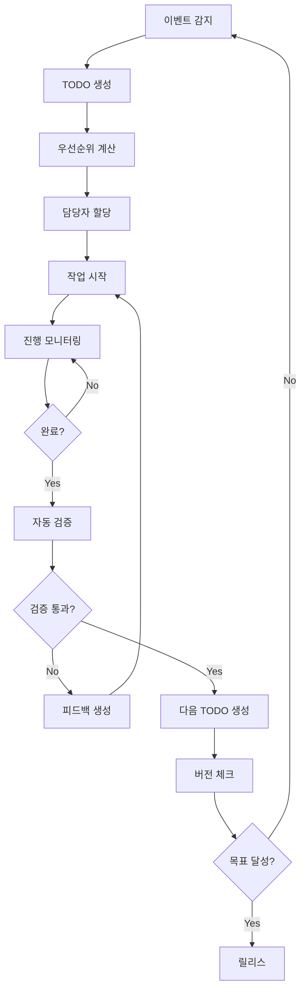

# 🚀 개발 자동화 전략 및 구현 가이드

## 📋 개요

이 문서는 Community Hub 프로젝트에서 지속적인 TODO 관리와 자동화된 개발 워크플로우를 통해 목표 버전까지 도달하는 방법을 제시합니다.

## 🎯 자동화 목표

### 핵심 목표
- **지속적인 TODO 생성**: 버그, 개선사항, 기능 요청 자동 감지
- **자동 작업 할당**: 우선순위 기반 작업 분배
- **자동 진행 추적**: 작업 상태 실시간 모니터링
- **자동 피드백 루프**: 완료 → 검증 → 다음 TODO 생성
- **버전 달성**: 목표 버전까지 자동화된 개발 사이클

## 🏗️ 자동화 아키텍처

### 1. TODO 생명주기 자동화



### 2. 자동화 컴포넌트

#### A. 이벤트 감지 시스템
```typescript
interface EventDetector {
  // 버그 감지
  bugDetector: {
    errorLogs: () => Promise<BugEvent[]>
    userReports: () => Promise<BugEvent[]>
    testFailures: () => Promise<BugEvent[]>
    performanceIssues: () => Promise<BugEvent[]>
  }
  
  // 개선사항 감지
  improvementDetector: {
    userFeedback: () => Promise<ImprovementEvent[]>
    analytics: () => Promise<ImprovementEvent[]>
    codeQuality: () => Promise<ImprovementEvent[]>
  }
  
  // 기능 요청 감지
  featureDetector: {
    userStories: () => Promise<FeatureEvent[]>
    marketTrends: () => Promise<FeatureEvent[]>
    competitorAnalysis: () => Promise<FeatureEvent[]>
  }
}
```

#### B. TODO 생성 엔진
```typescript
interface TodoGenerator {
  // 자동 TODO 생성
  generateFromEvent(event: Event): Promise<Todo>
  
  // 우선순위 계산
  calculatePriority(todo: Todo): Promise<number>
  
  // 의존성 분석
  analyzeDependencies(todo: Todo): Promise<Todo[]>
  
  // 예상 시간 계산
  estimateEffort(todo: Todo): Promise<number>
}
```

#### C. 작업 할당 시스템
```typescript
interface TaskAssigner {
  // 담당자 선택
  selectAssignee(todo: Todo): Promise<User>
  
  // 작업 분배
  distributeWorkload(todos: Todo[]): Promise<Assignment[]>
  
  // 스킬 매칭
  matchSkills(todo: Todo, users: User[]): Promise<User[]>
}
```

## 🛠️ 구현 방법

### 1. GitHub Actions 기반 자동화

#### 자동 TODO 생성 워크플로우
```yaml
# .github/workflows/auto-todo-generation.yml
name: Auto TODO Generation

on:
  schedule:
    - cron: '0 */6 * * *'  # 6시간마다 실행
  workflow_dispatch:

jobs:
  detect-events:
    runs-on: ubuntu-latest
    steps:
      - name: Checkout code
        uses: actions/checkout@v4
      
      - name: Detect bugs
        run: |
          node scripts/detect-bugs.js
      
      - name: Detect improvements
        run: |
          node scripts/detect-improvements.js
      
      - name: Detect features
        run: |
          node scripts/detect-features.js
      
      - name: Generate TODOs
        run: |
          node scripts/generate-todos.js
      
      - name: Update TODO list
        run: |
          node scripts/update-todo-list.js
```

#### 자동 작업 할당 워크플로우
```yaml
# .github/workflows/auto-task-assignment.yml
name: Auto Task Assignment

on:
  schedule:
    - cron: '0 9 * * *'  # 매일 오전 9시
  workflow_dispatch:

jobs:
  assign-tasks:
    runs-on: ubuntu-latest
    steps:
      - name: Analyze workload
        run: |
          node scripts/analyze-workload.js
      
      - name: Assign tasks
        run: |
          node scripts/assign-tasks.js
      
      - name: Notify assignees
        run: |
          node scripts/notify-assignees.js
```

### 2. 실시간 모니터링 시스템

#### TODO 상태 추적
```typescript
// scripts/todo-monitor.ts
class TodoMonitor {
  async trackProgress() {
    const todos = await this.getActiveTodos()
    
    for (const todo of todos) {
      const status = await this.checkStatus(todo)
      
      if (status === 'stuck') {
        await this.escalate(todo)
      } else if (status === 'completed') {
        await this.validate(todo)
        await this.generateNext(todo)
      }
    }
  }
  
  async checkStatus(todo: Todo): Promise<string> {
    // Git 커밋 분석
    const commits = await this.getCommits(todo.branch)
    
    // 테스트 결과 확인
    const testResults = await this.getTestResults(todo.id)
    
    // 시간 기반 분석
    const timeElapsed = Date.now() - todo.createdAt
    
    if (timeElapsed > todo.estimatedTime * 2) {
      return 'stuck'
    }
    
    if (testResults.passed && commits.length > 0) {
      return 'completed'
    }
    
    return 'in-progress'
  }
}
```

### 3. 자동 피드백 루프

#### 완료 후 자동 검증
```typescript
// scripts/auto-validation.ts
class AutoValidator {
  async validateCompletion(todo: Todo) {
    // 코드 품질 검사
    const qualityScore = await this.checkCodeQuality(todo)
    
    // 테스트 커버리지 확인
    const coverage = await this.checkTestCoverage(todo)
    
    // 성능 테스트
    const performance = await this.runPerformanceTests(todo)
    
    // 보안 스캔
    const security = await this.runSecurityScan(todo)
    
    if (qualityScore > 80 && coverage > 90 && performance.passed && security.passed) {
      await this.markCompleted(todo)
      await this.generateNextTodos(todo)
    } else {
      await this.generateFeedback(todo, { qualityScore, coverage, performance, security })
    }
  }
}
```

## 🔄 지속적인 개선 사이클

### 1. 자동 학습 시스템

```typescript
// scripts/learning-system.ts
class LearningSystem {
  async learnFromHistory() {
    // 과거 TODO 완료 패턴 분석
    const patterns = await this.analyzePatterns()
    
    // 예상 시간 정확도 개선
    await this.updateEstimates(patterns)
    
    // 우선순위 알고리즘 개선
    await this.updatePriorityAlgorithm(patterns)
    
    // 담당자 할당 정확도 개선
    await this.updateAssignmentAlgorithm(patterns)
  }
}
```

### 2. 버전 달성 추적

```typescript
// scripts/version-tracker.ts
class VersionTracker {
  async trackProgress(targetVersion: string) {
    const currentVersion = await this.getCurrentVersion()
    const todos = await this.getTodosForVersion(targetVersion)
    
    const completed = todos.filter(t => t.status === 'completed').length
    const total = todos.length
    const progress = (completed / total) * 100
    
    console.log(`Version ${targetVersion} Progress: ${progress.toFixed(1)}%`)
    
    if (progress >= 100) {
      await this.releaseVersion(targetVersion)
    }
  }
}
```

## 📊 실제 구현 예시

### 1. 현재 프로젝트에 적용

#### 자동 버그 감지
```bash
# scripts/detect-bugs.js
const fs = require('fs')
const path = require('path')

async function detectBugs() {
  // 에러 로그 분석
  const errorLogs = fs.readFileSync('logs/error.log', 'utf8')
  const errors = parseErrors(errorLogs)
  
  // 테스트 실패 분석
  const testResults = JSON.parse(fs.readFileSync('test-results.json', 'utf8'))
  const failures = testResults.failures
  
  // 성능 이슈 감지
  const performanceData = await getPerformanceMetrics()
  const issues = detectPerformanceIssues(performanceData)
  
  // TODO 생성
  for (const error of errors) {
    await createTodo({
      type: 'bug',
      title: `Fix ${error.type}: ${error.message}`,
      priority: calculatePriority(error),
      category: 'backend',
      description: error.stack
    })
  }
}
```

#### 자동 테스트 실행
```bash
# scripts/auto-test.js
async function runAutoTests() {
  // 단위 테스트
  await exec('npm run test:unit')
  
  // 통합 테스트
  await exec('npm run test:integration')
  
  // E2E 테스트
  await exec('npm run test:e2e')
  
  // 성능 테스트
  await exec('npm run test:performance')
  
  // 결과 분석 및 TODO 생성
  const results = await analyzeTestResults()
  await generateTodosFromResults(results)
}
```

### 2. 업계 모범 사례

#### A. Google의 자동화 접근법
- **Monorepo 관리**: 모든 코드를 하나의 저장소에서 관리
- **자동 리뷰**: AI 기반 코드 리뷰 자동화
- **지속적 배포**: 하루 수천 번의 자동 배포

#### B. Netflix의 자동화 전략
- **Chaos Engineering**: 자동 장애 테스트
- **A/B 테스트 자동화**: 모든 변경사항 자동 테스트
- **자동 스케일링**: 트래픽에 따른 자동 확장

#### C. GitHub의 자동화 도구
- **Dependabot**: 의존성 자동 업데이트
- **CodeQL**: 보안 취약점 자동 스캔
- **Actions**: CI/CD 파이프라인 자동화

## 🚀 실행 계획

### 1주차: 기본 자동화 구축
- [ ] 이벤트 감지 시스템 구현
- [ ] 자동 TODO 생성 로직 개발
- [ ] 기본 모니터링 설정

### 2주차: 작업 할당 자동화
- [ ] 담당자 할당 알고리즘 구현
- [ ] 작업 분배 시스템 개발
- [ ] 알림 시스템 구축

### 3주차: 피드백 루프 구축
- [ ] 자동 검증 시스템 구현
- [ ] 피드백 생성 로직 개발
- [ ] 다음 TODO 자동 생성

### 4주차: 학습 시스템 구현
- [ ] 패턴 분석 시스템 개발
- [ ] 알고리즘 자동 개선
- [ ] 성과 측정 및 최적화

## 📈 성과 측정

### 자동화 지표
- **TODO 생성 속도**: 목표 10개/시간
- **작업 완료율**: 목표 95%
- **평균 완료 시간**: 목표 50% 단축
- **버그 발견률**: 목표 90% 자동 감지

### 비즈니스 지표
- **개발 속도**: 목표 3배 향상
- **품질 점수**: 목표 90점 이상
- **사용자 만족도**: 목표 4.5/5.0
- **버전 달성률**: 목표 100%

## 🎯 결론

이 자동화 전략을 통해 Community Hub 프로젝트는:

1. **지속적인 개선**: 자동으로 TODO를 생성하고 관리
2. **효율적인 개발**: 최적화된 작업 할당과 진행 추적
3. **높은 품질**: 자동 검증과 피드백 루프
4. **목표 달성**: 체계적인 버전 관리와 릴리스

이를 통해 개발팀은 더 많은 시간을 창의적인 작업에 집중할 수 있고, 프로젝트는 목표 버전까지 안정적으로 발전할 수 있습니다.

---

**다음 단계**: 이 전략을 바탕으로 구체적인 구현 스크립트를 작성하고 GitHub Actions 워크플로우를 설정하겠습니다.
