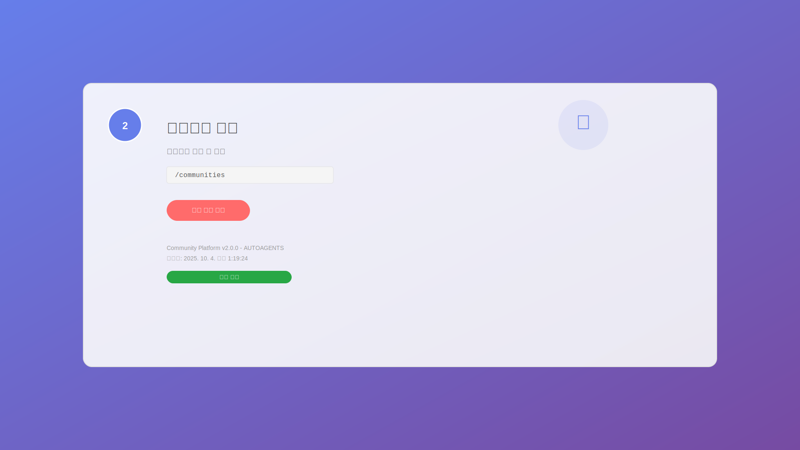
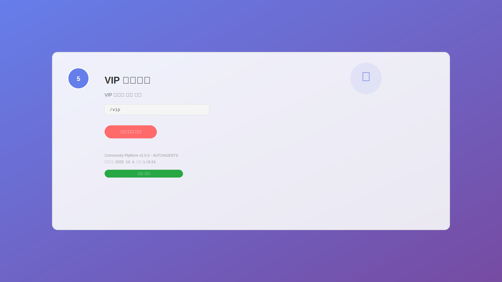
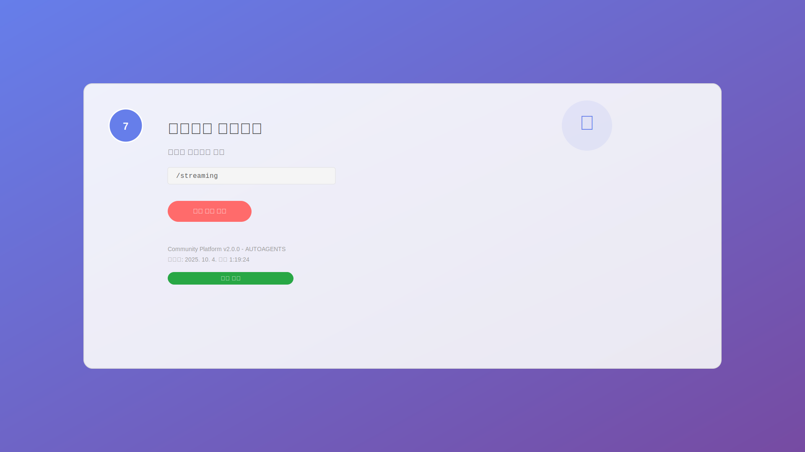

# 🎬 Community Platform v2.0.0 기능 시각화 보고서

**생성일**: 2025. 10. 4. 오후 1:19:24  
**총 기능 수**: 13개  
**상태**: 플레이스홀더 이미지 생성 완료

---

## 📸 기능별 스크린샷

### 1. 메인 페이지

**URL**: `/`  
**설명**: 커뮤니티 플랫폼 메인 페이지  
**상태**: 📸 플레이스홀더 생성 완료  
**캡처 시간**: 2025-10-04T04:19:24.169Z

### 2. 커뮤니티 허브

**URL**: `/communities`  
**설명**: 커뮤니티 목록 및 관리  
**상태**: 📸 플레이스홀더 생성 완료  
**캡처 시간**: 2025-10-04T04:19:24.170Z

### 3. 대시보드

**URL**: `/dashboard`  
**설명**: 사용자 대시보드  
**상태**: 📸 플레이스홀더 생성 완료  
**캡처 시간**: 2025-10-04T04:19:24.170Z

### 4. 게임 센터

**URL**: `/games`  
**설명**: 게임 시스템 및 리더보드  
**상태**: 📸 플레이스홀더 생성 완료  
**캡처 시간**: 2025-10-04T04:19:24.170Z

### 5. VIP 대시보드

**URL**: `/vip`  
**설명**: VIP 사용자 전용 기능  
**상태**: 📸 플레이스홀더 생성 완료  
**캡처 시간**: 2025-10-04T04:19:24.170Z

### 6. 코스프레 상점

**URL**: `/cosplay`  
**설명**: 코스프레 의상 및 액세서리  
**상태**: 📸 플레이스홀더 생성 완료  
**캡처 시간**: 2025-10-04T04:19:24.170Z

### 7. 스트리밍 스테이션

**URL**: `/streaming`  
**설명**: 실시간 스트리밍 기능  
**상태**: 📸 플레이스홀더 생성 완료  
**캡처 시간**: 2025-10-04T04:19:24.170Z

### 8. 커뮤니티 분석

**URL**: `/analytics`  
**설명**: 사용자 행동 분석 및 인사이트  
**상태**: 📸 플레이스홀더 생성 완료  
**캡처 시간**: 2025-10-04T04:19:24.170Z

### 9. 성과 지표

**URL**: `/metrics`  
**설명**: KPI 및 성과 지표 대시보드  
**상태**: 📸 플레이스홀더 생성 완료  
**캡처 시간**: 2025-10-04T04:19:24.170Z

### 10. 스팸 방지

**URL**: `/spam-prevention`  
**설명**: 스팸 방지 및 보안 시스템  
**상태**: 📸 플레이스홀더 생성 완료  
**캡처 시간**: 2025-10-04T04:19:24.170Z

### 11. 신고 관리

**URL**: `/report-management`  
**설명**: 사용자 신고 및 처리 시스템  
**상태**: 📸 플레이스홀더 생성 완료  
**캡처 시간**: 2025-10-04T04:19:24.170Z

### 12. 자동 모더레이션

**URL**: `/auto-moderation`  
**설명**: AI 기반 자동 콘텐츠 검토  
**상태**: 📸 플레이스홀더 생성 완료  
**캡처 시간**: 2025-10-04T04:19:24.170Z

### 13. 국제화

**URL**: `/internationalization`  
**설명**: 다국어 지원 및 현지화  
**상태**: 📸 플레이스홀더 생성 완료  
**캡처 시간**: 2025-10-04T04:19:24.170Z

---

## 🎯 기능 요약

| 순번 | 기능명 | URL | 상태 | 스크린샷 |
|------|--------|-----|------|----------|
| 1 | 메인 페이지 | `/` | 📸 플레이스홀더 | [main-page.png](main-page.svg) |
| 2 | 커뮤니티 허브 | `/communities` | 📸 플레이스홀더 | [community-hub.png](community-hub.svg) |
| 3 | 대시보드 | `/dashboard` | 📸 플레이스홀더 | [dashboard.png](dashboard.svg) |
| 4 | 게임 센터 | `/games` | 📸 플레이스홀더 | [game-center.png](game-center.svg) |
| 5 | VIP 대시보드 | `/vip` | 📸 플레이스홀더 | [vip-dashboard.png](vip-dashboard.svg) |
| 6 | 코스프레 상점 | `/cosplay` | 📸 플레이스홀더 | [cosplay-shop.png](cosplay-shop.svg) |
| 7 | 스트리밍 스테이션 | `/streaming` | 📸 플레이스홀더 | [streaming-station.png](streaming-station.svg) |
| 8 | 커뮤니티 분석 | `/analytics` | 📸 플레이스홀더 | [community-analytics.png](community-analytics.svg) |
| 9 | 성과 지표 | `/metrics` | 📸 플레이스홀더 | [performance-metrics.png](performance-metrics.svg) |
| 10 | 스팸 방지 | `/spam-prevention` | 📸 플레이스홀더 | [spam-prevention.png](spam-prevention.svg) |
| 11 | 신고 관리 | `/report-management` | 📸 플레이스홀더 | [report-management.png](report-management.svg) |
| 12 | 자동 모더레이션 | `/auto-moderation` | 📸 플레이스홀더 | [auto-moderation.png](auto-moderation.svg) |
| 13 | 국제화 | `/internationalization` | 📸 플레이스홀더 | [internationalization.png](internationalization.svg) |

---

## 🚀 사용 방법

1. **서버 실행**: `cd frontend && npm run dev`
2. **브라우저 접속**: http://localhost:3000
3. **기능 테스트**: 각 URL로 직접 접속하여 테스트
4. **실제 스크린샷**: 서버 실행 후 다시 스크립트 실행

---

**생성자**: AUTOAGENTS Manager  
**버전**: 2.0.0  
**생성일**: 2025-10-04T04:19:24.170Z
