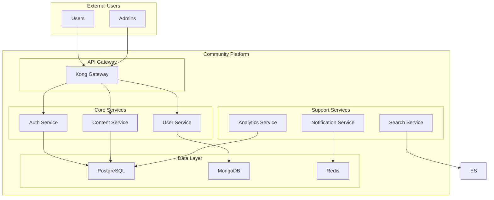

# Community Platform 마이크로서비스 마이그레이션 가이드

## 📋 개요

이 가이드는 Community Platform을 모놀리식 아키텍처에서 마이크로서비스 아키텍처로 전환하는 과정을 설명합니다.

## 🎯 마이그레이션 목표

- **확장성 향상**: 서비스별 독립적 스케일링
- **유지보수성 개선**: 서비스별 독립적 개발 및 배포
- **장애 격리**: 서비스 간 장애 전파 방지
- **기술 스택 다양화**: 서비스별 최적 기술 선택
- **팀 독립성**: 서비스별 팀 소유권

## 🏗️ 마이그레이션 전략

### 1. Strangler Fig 패턴

기존 모놀리식을 점진적으로 대체하는 전략을 사용합니다.

```
기존 모놀리식 → API Gateway → 마이크로서비스들
```

### 2. 마이그레이션 단계

#### Phase 1: 인프라 준비 (1-2주)
- [ ] API Gateway 도입
- [ ] 서비스 메시 설정
- [ ] 모니터링 시스템 구축
- [ ] CI/CD 파이프라인 구축

#### Phase 2: 인증 서비스 분리 (1주)
- [ ] 인증 로직 추출
- [ ] JWT 토큰 관리
- [ ] 사용자 세션 관리
- [ ] OAuth 2.0 통합

#### Phase 3: 사용자 서비스 분리 (1주)
- [ ] 사용자 프로필 관리
- [ ] 사용자 설정
- [ ] 팔로우/팔로워 기능
- [ ] 사용자 검색

#### Phase 4: 콘텐츠 서비스 분리 (2주)
- [ ] 게시글 CRUD
- [ ] 댓글 시스템
- [ ] 좋아요/북마크
- [ ] 콘텐츠 검증

#### Phase 5: 부가 서비스 분리 (2주)
- [ ] 알림 서비스
- [ ] 분석 서비스
- [ ] 검색 서비스
- [ ] 파일 서비스

#### Phase 6: 채팅 서비스 분리 (1주)
- [ ] 실시간 채팅
- [ ] 그룹 채팅
- [ ] 파일 공유
- [ ] 메시지 히스토리

#### Phase 7: 관리자 서비스 분리 (1주)
- [ ] 사용자 관리
- [ ] 콘텐츠 관리
- [ ] 시스템 설정
- [ ] 통계 및 리포트

#### Phase 8: 데이터 마이그레이션 (1주)
- [ ] 데이터베이스 분리
- [ ] 데이터 동기화
- [ ] 데이터 검증
- [ ] 백업 및 복구

#### Phase 9: 최적화 및 모니터링 (1주)
- [ ] 성능 최적화
- [ ] 보안 강화
- [ ] 모니터링 설정
- [ ] 알림 설정

## 🔧 기술적 구현

### 1. API Gateway 설정

```yaml
# Kong 설정 예시
services:
  - name: auth-service
    url: http://auth-service:3001
    routes:
      - name: auth-routes
        paths:
          - /api/auth
        methods:
          - GET
          - POST
          - PUT
          - DELETE
        strip_path: true
    plugins:
      - name: rate-limiting
        config:
          minute: 100
          hour: 1000
      - name: cors
        config:
          origins:
            - "http://localhost:3000"
            - "https://community.example.com"
```

### 2. 서비스 간 통신

#### 동기 통신 (HTTP/gRPC)
```javascript
// 사용자 서비스에서 인증 서비스 호출
const authResponse = await fetch('http://auth-service:3001/api/auth/verify', {
  method: 'POST',
  headers: {
    'Content-Type': 'application/json',
    'Authorization': `Bearer ${token}`
  },
  body: JSON.stringify({ token })
});
```

#### 비동기 통신 (Message Queue)
```javascript
// Kafka를 통한 이벤트 발행
const kafka = require('kafkajs');

const client = kafka({
  clientId: 'user-service',
  brokers: ['kafka:9092']
});

const producer = client.producer();

await producer.send({
  topic: 'user.created',
  messages: [{
    key: userId,
    value: JSON.stringify({
      userId,
      email,
      createdAt: new Date()
    })
  }]
});
```

### 3. 데이터 일관성

#### Saga 패턴
```javascript
// 사용자 생성 Saga
class CreateUserSaga {
  async execute(userData) {
    const transaction = await this.beginTransaction();
    
    try {
      // 1. 사용자 생성
      const user = await this.userService.create(userData, transaction);
      
      // 2. 환영 이메일 발송
      await this.notificationService.sendWelcomeEmail(user.email);
      
      // 3. 분석 데이터 수집
      await this.analyticsService.trackUserRegistration(user);
      
      await transaction.commit();
      return user;
    } catch (error) {
      await transaction.rollback();
      throw error;
    }
  }
}
```

#### Event Sourcing
```javascript
// 이벤트 저장
class EventStore {
  async saveEvent(aggregateId, event) {
    await this.database.events.insert({
      aggregateId,
      eventType: event.type,
      eventData: event.data,
      timestamp: new Date(),
      version: event.version
    });
  }
  
  async getEvents(aggregateId) {
    return await this.database.events
      .where('aggregateId', aggregateId)
      .orderBy('version')
      .select();
  }
}
```

### 4. 서비스 디스커버리

#### Kubernetes Service Discovery
```yaml
# 서비스 등록
apiVersion: v1
kind: Service
metadata:
  name: auth-service
  namespace: community-platform
spec:
  selector:
    app: auth-service
  ports:
  - port: 3001
    targetPort: 3001
```

#### Consul Service Discovery
```javascript
// Consul을 통한 서비스 발견
const consul = require('consul');

const consulClient = consul({
  host: 'consul-server',
  port: 8500
});

// 서비스 등록
await consulClient.agent.service.register({
  name: 'auth-service',
  port: 3001,
  check: {
    http: 'http://localhost:3001/health',
    interval: '10s'
  }
});

// 서비스 발견
const services = await consulClient.health.service({
  service: 'auth-service',
  passing: true
});
```

## 📊 모니터링 및 관찰 가능성

### 1. 로깅

#### 구조화된 로깅
```javascript
// Winston을 사용한 구조화된 로깅
const winston = require('winston');

const logger = winston.createLogger({
  format: winston.format.combine(
    winston.format.timestamp(),
    winston.format.errors({ stack: true }),
    winston.format.json()
  ),
  transports: [
    new winston.transports.Console(),
    new winston.transports.File({ filename: 'app.log' })
  ]
});

// 사용 예시
logger.info('User created', {
  userId: user.id,
  email: user.email,
  service: 'user-service',
  traceId: req.traceId
});
```

#### ELK Stack
```yaml
# Elasticsearch 설정
apiVersion: apps/v1
kind: Deployment
metadata:
  name: elasticsearch
spec:
  template:
    spec:
      containers:
      - name: elasticsearch
        image: docker.elastic.co/elasticsearch/elasticsearch:8.11.0
        env:
        - name: discovery.type
          value: "single-node"
        - name: xpack.security.enabled
          value: "false"
```

### 2. 메트릭

#### Prometheus 메트릭
```javascript
// Prometheus 메트릭 수집
const prometheus = require('prom-client');

const httpRequestDuration = new prometheus.Histogram({
  name: 'http_request_duration_seconds',
  help: 'Duration of HTTP requests in seconds',
  labelNames: ['method', 'route', 'status_code']
});

const httpRequestTotal = new prometheus.Counter({
  name: 'http_requests_total',
  help: 'Total number of HTTP requests',
  labelNames: ['method', 'route', 'status_code']
});

// 미들웨어에서 메트릭 수집
app.use((req, res, next) => {
  const start = Date.now();
  
  res.on('finish', () => {
    const duration = (Date.now() - start) / 1000;
    httpRequestDuration
      .labels(req.method, req.route?.path || req.path, res.statusCode)
      .observe(duration);
    
    httpRequestTotal
      .labels(req.method, req.route?.path || req.path, res.statusCode)
      .inc();
  });
  
  next();
});
```

### 3. 추적 (Tracing)

#### Jaeger 추적
```javascript
// OpenTelemetry를 사용한 분산 추적
const { trace, context } = require('@opentelemetry/api');
const { NodeTracerProvider } = require('@opentelemetry/node');
const { JaegerExporter } = require('@opentelemetry/exporter-jaeger');

const tracerProvider = new NodeTracerProvider();
tracerProvider.addSpanProcessor(new JaegerExporter({
  endpoint: 'http://jaeger:14268/api/traces'
}));
trace.setGlobalTracerProvider(tracerProvider);

// 스팬 생성
const tracer = trace.getTracer('user-service');

app.post('/api/users', async (req, res) => {
  const span = tracer.startSpan('create-user');
  
  try {
    const user = await userService.create(req.body);
    span.setStatus({ code: trace.SpanStatusCode.OK });
    res.json(user);
  } catch (error) {
    span.setStatus({ code: trace.SpanStatusCode.ERROR, message: error.message });
    res.status(500).json({ error: error.message });
  } finally {
    span.end();
  }
});
```

## 🔒 보안

### 1. 서비스 간 인증

#### mTLS (Mutual TLS)
```yaml
# Istio PeerAuthentication
apiVersion: security.istio.io/v1beta1
kind: PeerAuthentication
metadata:
  name: community-mtls
  namespace: community-platform
spec:
  mtls:
    mode: STRICT
```

#### JWT 토큰 검증
```javascript
// JWT 토큰 검증 미들웨어
const jwt = require('jsonwebtoken');

const verifyToken = (req, res, next) => {
  const token = req.headers.authorization?.split(' ')[1];
  
  if (!token) {
    return res.status(401).json({ error: 'No token provided' });
  }
  
  try {
    const decoded = jwt.verify(token, process.env.JWT_SECRET);
    req.user = decoded;
    next();
  } catch (error) {
    return res.status(401).json({ error: 'Invalid token' });
  }
};
```

### 2. 네트워크 보안

#### Network Policies
```yaml
# Kubernetes Network Policy
apiVersion: networking.k8s.io/v1
kind: NetworkPolicy
metadata:
  name: community-network-policy
  namespace: community-platform
spec:
  podSelector:
    matchLabels:
      app: community-platform
  policyTypes:
  - Ingress
  - Egress
  ingress:
  - from:
    - namespaceSelector:
        matchLabels:
          name: community-platform
    ports:
    - protocol: TCP
      port: 3000
  egress:
  - to:
    - namespaceSelector:
        matchLabels:
          name: community-platform
    ports:
    - protocol: TCP
      port: 3000
```

## 🚀 배포 및 운영

### 1. CI/CD 파이프라인

#### GitHub Actions
```yaml
# .github/workflows/deploy.yml
name: Deploy to Kubernetes

on:
  push:
    branches: [main]

jobs:
  deploy:
    runs-on: ubuntu-latest
    steps:
    - uses: actions/checkout@v2
    
    - name: Build Docker images
      run: |
        docker build -t community-platform/auth-service:latest ./services/auth-service
        docker build -t community-platform/user-service:latest ./services/user-service
        # ... other services
    
    - name: Deploy to Kubernetes
      run: |
        kubectl apply -f microservices/k8s/
        kubectl rollout restart deployment/auth-service
        kubectl rollout restart deployment/user-service
        # ... other services
```

#### ArgoCD (GitOps)
```yaml
# argocd-app.yaml
apiVersion: argoproj.io/v1alpha1
kind: Application
metadata:
  name: community-platform
  namespace: argocd
spec:
  project: default
  source:
    repoURL: https://github.com/your-org/community-platform
    targetRevision: HEAD
    path: microservices/k8s
  destination:
    server: https://kubernetes.default.svc
    namespace: community-platform
  syncPolicy:
    automated:
      prune: true
      selfHeal: true
```

### 2. 스케일링

#### HPA (Horizontal Pod Autoscaler)
```yaml
# HPA 설정
apiVersion: autoscaling/v2
kind: HorizontalPodAutoscaler
metadata:
  name: auth-service-hpa
spec:
  scaleTargetRef:
    apiVersion: apps/v1
    kind: Deployment
    name: auth-service
  minReplicas: 2
  maxReplicas: 10
  metrics:
  - type: Resource
    resource:
      name: cpu
      target:
        type: Utilization
        averageUtilization: 70
```

#### VPA (Vertical Pod Autoscaler)
```yaml
# VPA 설정
apiVersion: autoscaling.k8s.io/v1
kind: VerticalPodAutoscaler
metadata:
  name: auth-service-vpa
spec:
  targetRef:
    apiVersion: apps/v1
    kind: Deployment
    name: auth-service
  updatePolicy:
    updateMode: "Auto"
```

### 3. 백업 및 복구

#### 데이터베이스 백업
```bash
#!/bin/bash
# PostgreSQL 백업 스크립트

# 백업 생성
kubectl exec -n community-platform postgres-0 -- pg_dump -U postgres community > backup_$(date +%Y%m%d_%H%M%S).sql

# S3에 업로드
aws s3 cp backup_$(date +%Y%m%d_%H%M%S).sql s3://community-backups/

# 로컬 백업 삭제
rm backup_$(date +%Y%m%d_%H%M%S).sql
```

#### Velero를 사용한 클러스터 백업
```yaml
# Velero 백업 설정
apiVersion: velero.io/v1
kind: Schedule
metadata:
  name: community-platform-backup
  namespace: velero
spec:
  schedule: "0 2 * * *"  # 매일 오전 2시
  template:
    includedNamespaces:
    - community-platform
    storageLocation: default
    volumeSnapshotLocations:
    - default
```

## 🧪 테스트 전략

### 1. 단위 테스트

```javascript
// Jest를 사용한 단위 테스트
describe('UserService', () => {
  let userService;
  let mockDatabase;
  
  beforeEach(() => {
    mockDatabase = {
      users: {
        findById: jest.fn(),
        create: jest.fn(),
        update: jest.fn(),
        delete: jest.fn()
      }
    };
    userService = new UserService(mockDatabase);
  });
  
  describe('createUser', () => {
    it('should create a user successfully', async () => {
      const userData = {
        email: 'test@example.com',
        name: 'Test User'
      };
      
      mockDatabase.users.create.mockResolvedValue({
        id: '123',
        ...userData
      });
      
      const result = await userService.createUser(userData);
      
      expect(result).toEqual({
        id: '123',
        ...userData
      });
      expect(mockDatabase.users.create).toHaveBeenCalledWith(userData);
    });
  });
});
```

### 2. 통합 테스트

```javascript
// Supertest를 사용한 통합 테스트
const request = require('supertest');
const app = require('../app');

describe('User API', () => {
  describe('POST /api/users', () => {
    it('should create a user', async () => {
      const userData = {
        email: 'test@example.com',
        name: 'Test User'
      };
      
      const response = await request(app)
        .post('/api/users')
        .send(userData)
        .expect(201);
      
      expect(response.body).toHaveProperty('id');
      expect(response.body.email).toBe(userData.email);
    });
  });
});
```

### 3. E2E 테스트

```javascript
// Playwright를 사용한 E2E 테스트
const { test, expect } = require('@playwright/test');

test('user registration flow', async ({ page }) => {
  await page.goto('http://localhost:3000/register');
  
  await page.fill('[data-testid=email]', 'test@example.com');
  await page.fill('[data-testid=name]', 'Test User');
  await page.fill('[data-testid=password]', 'password123');
  
  await page.click('[data-testid=submit]');
  
  await expect(page).toHaveURL('/dashboard');
  await expect(page.locator('[data-testid=welcome]')).toContainText('Welcome, Test User');
});
```

### 4. 카오스 엔지니어링

```javascript
// Chaos Monkey를 사용한 카오스 테스트
const chaos = require('chaos-monkey');

describe('Chaos Engineering', () => {
  it('should handle service failure gracefully', async () => {
    // 서비스 장애 시뮬레이션
    chaos.killService('auth-service');
    
    // 시스템이 여전히 작동하는지 확인
    const response = await request(app)
      .get('/api/public/posts')
      .expect(200);
    
    expect(response.body).toBeDefined();
    
    // 서비스 복구
    chaos.restoreService('auth-service');
  });
});
```

## 📈 성능 최적화

### 1. 캐싱 전략

#### Redis 캐싱
```javascript
// Redis를 사용한 캐싱
const redis = require('redis');
const client = redis.createClient({
  host: 'redis-service',
  port: 6379
});

class UserService {
  async getUserById(id) {
    // 캐시에서 먼저 확인
    const cached = await client.get(`user:${id}`);
    if (cached) {
      return JSON.parse(cached);
    }
    
    // 데이터베이스에서 조회
    const user = await this.database.users.findById(id);
    
    // 캐시에 저장 (5분 TTL)
    await client.setex(`user:${id}`, 300, JSON.stringify(user));
    
    return user;
  }
}
```

#### CDN 설정
```yaml
# CloudFlare CDN 설정
apiVersion: v1
kind: ConfigMap
metadata:
  name: nginx-config
data:
  nginx.conf: |
    server {
      listen 80;
      server_name community.example.com;
      
      location /static/ {
        expires 1y;
        add_header Cache-Control "public, immutable";
        proxy_pass http://file-service:3007;
      }
      
      location /api/ {
        proxy_pass http://api-gateway:8000;
        proxy_set_header Host $host;
        proxy_set_header X-Real-IP $remote_addr;
      }
    }
```

### 2. 데이터베이스 최적화

#### 읽기 복제본
```yaml
# PostgreSQL 읽기 복제본
apiVersion: apps/v1
kind: StatefulSet
metadata:
  name: postgres-replica
spec:
  replicas: 2
  template:
    spec:
      containers:
      - name: postgres
        image: postgres:15-alpine
        env:
        - name: POSTGRES_REPLICATION_MODE
          value: "slave"
        - name: POSTGRES_MASTER_HOST
          value: "postgres-service"
```

#### 샤딩
```javascript
// 데이터베이스 샤딩
class ShardedUserService {
  constructor() {
    this.shards = [
      new UserShard('shard1', 'postgres-shard1:5432'),
      new UserShard('shard2', 'postgres-shard2:5432'),
      new UserShard('shard3', 'postgres-shard3:5432')
    ];
  }
  
  getShard(userId) {
    const hash = this.hash(userId);
    return this.shards[hash % this.shards.length];
  }
  
  async getUserById(userId) {
    const shard = this.getShard(userId);
    return await shard.getUserById(userId);
  }
}
```

## 🔄 롤백 전략

### 1. Blue-Green 배포

```yaml
# Blue-Green 배포 설정
apiVersion: argoproj.io/v1alpha1
kind: Rollout
metadata:
  name: auth-service-rollout
spec:
  replicas: 5
  strategy:
    blueGreen:
      activeService: auth-service-active
      previewService: auth-service-preview
      autoPromotionEnabled: false
      scaleDownDelaySeconds: 30
      prePromotionAnalysis:
        templates:
        - templateName: success-rate
        args:
        - name: service-name
          value: auth-service-preview
      postPromotionAnalysis:
        templates:
        - templateName: success-rate
        args:
        - name: service-name
          value: auth-service-active
```

### 2. Canary 배포

```yaml
# Canary 배포 설정
apiVersion: argoproj.io/v1alpha1
kind: Rollout
metadata:
  name: user-service-rollout
spec:
  replicas: 5
  strategy:
    canary:
      steps:
      - setWeight: 20
      - pause: {duration: 10m}
      - setWeight: 40
      - pause: {duration: 10m}
      - setWeight: 60
      - pause: {duration: 10m}
      - setWeight: 80
      - pause: {duration: 10m}
      analysis:
        templates:
        - templateName: success-rate
        args:
        - name: service-name
          value: user-service
```

## 📚 문서화

### 1. API 문서

#### OpenAPI/Swagger
```yaml
# openapi.yaml
openapi: 3.0.0
info:
  title: Community Platform API
  version: 2.0.0
  description: Community Platform 마이크로서비스 API

paths:
  /api/users:
    get:
      summary: 사용자 목록 조회
      parameters:
      - name: page
        in: query
        schema:
          type: integer
          default: 1
      - name: limit
        in: query
        schema:
          type: integer
          default: 10
      responses:
        '200':
          description: 성공
          content:
            application/json:
              schema:
                type: object
                properties:
                  users:
                    type: array
                    items:
                      $ref: '#/components/schemas/User'
                  pagination:
                    $ref: '#/components/schemas/Pagination'

components:
  schemas:
    User:
      type: object
      properties:
        id:
          type: string
        email:
          type: string
        name:
          type: string
        createdAt:
          type: string
          format: date-time
```

### 2. 아키텍처 문서

#### C4 Model


## 🎯 성공 지표

### 1. 기술적 지표

- **가용성**: 99.9% 이상
- **응답 시간**: 평균 200ms 이하
- **처리량**: 초당 1000 요청 처리
- **에러율**: 0.1% 이하

### 2. 비즈니스 지표

- **사용자 만족도**: 4.5/5 이상
- **개발 속도**: 50% 향상
- **배포 빈도**: 주 2회 이상
- **장애 복구 시간**: 5분 이하

### 3. 운영 지표

- **리소스 사용률**: 70% 이하
- **비용 효율성**: 30% 절감
- **보안 사고**: 0건
- **데이터 손실**: 0건

## 🚨 위험 요소 및 대응 방안

### 1. 기술적 위험

#### 서비스 간 통신 실패
- **위험**: 네트워크 분할, 서비스 장애
- **대응**: Circuit Breaker, Retry, Timeout 설정

#### 데이터 일관성 문제
- **위험**: 분산 트랜잭션 실패
- **대응**: Saga 패턴, Eventual Consistency

#### 성능 저하
- **위험**: 서비스 간 호출 증가
- **대응**: 캐싱, 비동기 처리, 최적화

### 2. 운영 위험

#### 복잡성 증가
- **위험**: 운영 복잡도 증가
- **대응**: 자동화, 모니터링, 문서화

#### 팀 간 의존성
- **위험**: 서비스 간 의존성 증가
- **대응**: API 계약 관리, 버전 관리

#### 보안 취약점
- **위험**: 서비스 간 보안 취약점
- **대응**: mTLS, JWT, 네트워크 정책

## 📞 지원 및 문의

### 1. 기술 지원

- **Slack**: #community-platform-support
- **이메일**: support@community.example.com
- **문서**: https://docs.community.example.com

### 2. 개발팀 연락처

- **아키텍처팀**: architecture@community.example.com
- **인프라팀**: infrastructure@community.example.com
- **보안팀**: security@community.example.com

---

*이 가이드는 Community Platform v2.0.0 마이크로서비스 마이그레이션을 위한 종합적인 가이드입니다.*
*최신 업데이트: 2024년 9월 28일*
